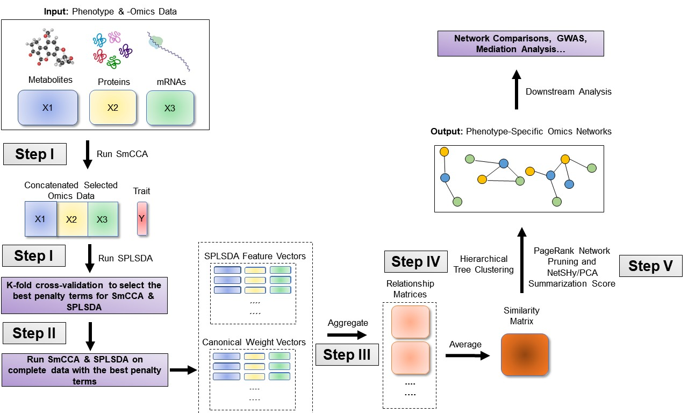

<!-- README.md is generated from README.Rmd. Please edit that file -->

# SmCCNet: A Comprehensive Tool for Multi-Omics Network Inference <a href=""></a>

<!-- badges: start -->

[](https://cran.r-project.org/web/packages/SmCCNet/index.html)
<!-- badges: end -->

**Note:** if you use SmCCNet in published research, please cite:

> Liu, W., Vu, T., Konigsberg, I. R., Pratte, K. A., Zhuang, Y., &
> Kechris, K. J. (2023). SmCCNet 2.0: an Upgraded R package for
> Multi-omics Network Inference. bioRxiv, 2023-11.

> Shi, W. J., Zhuang, Y., Russell, P. H., Hobbs, B. D., Parker, M. M.,
> Castaldi, P. J., … & Kechris, K. (2019). Unsupervised discovery of
> phenotype-specific multi-omics networks. Bioinformatics, 35(21),
> 4336-4343.

## Overview

SmCCNet is a framework designed for integrating one or multiple types of
omics data with a quantitative or binary phenotype. It’s based on the
concept of sparse multiple canonical analysis (SmCCA) and sparse partial
least squared discriminant analysis (SPLSDA) and aims to find
relationships between omics data and a specific phenotype. The framework
uses LASSO (Least Absolute Shrinkage and Selection Operator) for
sparsity constraints, allowing it to identify significant features
within the data.

The algorithm has two modes: weighted and unweighted. In the weighted
mode, it uses different scaling factors for each data type, while in the
unweighted mode, all scaling factors are equal. The choice of mode
affects how the data is analyzed and interpreted.

SmCCNet’s workflow consists of four main steps:

**Determine Sparsity Penalties**: The user selects sparsity penalties
for omics feature selection, either based on study needs, prior
knowledge, or through a K-fold cross-validation procedure. This step
ensures the selection of features is generalizable and avoids
overfitting.

**Subsample and Apply SmCCA**: Omics features are randomly subsampled
and analyzed using SmCCA with the chosen penalties. This process is
repeated multiple times to create a feature relationship matrix, which
is then averaged to form a similarity matrix.

**Identify Multi-Omics Networks**: The similarity matrix is analyzed
using hierarchical tree cutting to identify multiple subnetworks that
are relevant to the phenotype.

**Prune and Summarize Networks**: Finally, the identified networks are
pruned and summarized using a network pruning algorithm, refining the
results to highlight the most significant findings.

# SmCCNet Key Features

There are three major computational algorithms that are used for
difrerent number of datasets and phenotype modalities:

- Sparse Multiple Canonical Correlation Analysis (SmCCA)
- Sparse Partial Least Squared Discriminant Analysis (SPLSDA)
- Sparse Canonical Correlation Analysis (SCCA)

Unlock the Power of SmCCNet with These Key Features:

- 🧬 **Multi-Omics Network Inference**
  - With Quantitative Phenotype (SmCCA)
  - With Binary Phenotype (SmCCA + SPLSDA)
- 📊 **Single-Omics Network Inference**
  - With Quantitative Phenotype (SCCA)
  - With Binary Phenotype (SPLSDA)
- 🚀 **Automation Simplified**
  - Automated SmCCNet with a Single Line of Code

# SmCCNet Network Visualization

The final network generated from SmCCNet can be visualized in two ways:

- Shiny Application simply by uplooding the final .Rdata to [SmCCNet
  Visualization
  Application](https://smccnet.shinyapps.io/smccnetnetwork/).
- Cytoscape Software [Cytoscape](https://cytoscape.org/) through R
  package
  [RCy3](https://www.bioconductor.org/packages/release/bioc/html/RCy3.html).

# SmCCNet Workflow

## General Workflow


## Multi-Omics SmCCNet with Quantitative Phenotype


## Multi-Omics SmCCNet with Binary Phenotype



## Single-Omics SmCCNet


## SmCCNet Example Output Product


# Package Functions

The older version of the SmCCNet package includes four (external)
functions:

- **getRobustPseudoWeights()**: Compute aggregated (SmCCA) canonical
  weights.
- **getAbar()**: Calculate similarity matrix based on canonical weights.
- **getMultiOmicsModules()**: Perform hierarchical tree cutting on the
  similarity matrix and extract clades with multi-omics features.
- **plotMultiOmicsNetwork()**: Plot (pruned or full) multi-omics
  subnetworks.

In the updated package, all functions except for **getAbar** are retired
from the package, additional functions have been added to the package to
perform single-/multi-omics SmCCNet with quantitative/binary phenotype,
and their use is illustrated in this vignette:

- **aggregateCVSingle()**: Saving cross-validation result as the
  cross-validation table into the working directory and provide
  recommendation on the penalty term selection.
- **classifierEval()**: Evaluate binary classifier’s performance with
  respect to user-selected metric (accuracy, auc score, precision,
  recall, f1).
- **dataPreprocess()**: A simple pipeline to preprocess the data before
  running SmCCNet (center, scale, coefficient of variation filtering and
  regressing out covariates).
- **fastAutoSmCCNet()**: Automated SmCCNet automatically identifies the
  project problem (single-omics vs multi-omics), and type of analysis
  (CCA for quantitative phenotype vs. PLS for binary phenotype) based on
  the input data that is provided. This method automatically preprocess
  data, choose scaling factors, subsampling percentage, and optimal
  penalty terms, then runs through the complete SmCCNet pipeline without
  the requirement for users to provide additional information. This
  function will store all the subnetwork information to a user-provided
  directory, as well as return all the global network and evaluation
  information. Refer to the automated SmCCNet vignette for more
  information.
- **getCanWeightsMulti()**: Run Sparse Multiple Canonical Correlation
  Analysis (SmCCA) and return canonical weight.
- **getCanCorMulti()**: Get canonical correlation value for SmCCA given
  canonical weight vectors and scaling factors.
- **getRobustWeightsMulti()**: SmCCNet algorithm with multi-omics data
  and quantitative phenotype. Calculate the canonical weights for SmCCA.
- **getRobustWeightsMultiBinary()**: SmCCNet algorithm with multi-omics
  data and binary phenotype. First, SmCCA is used to identify
  relationship between omics (exlude phenotype). Then, after highly
  connected omics features are selected in step 1, SPLSDA is used to
  identify relationships between these omics features and phenotype(s).
  The sparse PLSDA algorithm for binary outcome first compute PLS by
  assuming outcome is continuous, and extracts multiple latent factors,
  then uses latent factors to fit the logistic regression, and weights
  latent factor by regression parameters.
- **getRobustWeightsSingle()**: Compute aggregated (SmCCA) canonical
  weights for single omics data with quantitative phenotype.
- **getRobustWeightsSingleBinary()**: Compute aggregated (SmCCA)
  canonical weights for single omics data with binary phenotype.
- **getOmicsModules()**: Perform hierarchical tree cutting on the
  similarity matrix and extract clades with omics features.
- **networkPruning()**: Extract summarization scores (the first 3
  NetSHy/regular prinicipal components) for specified network module
  with given network size. The omics features will be ranked based on
  PageRank algorithm, then the top $m$ omics features (where $m$ is the
  specified subnetwork size) will be included into the final subnetwork
  to generate the summarization score. For the PC score, the correlation
  with respect to the phenotype of interest will be calculated and
  stored. In addition, the correlation between individual omics features
  and the detected phenotype (with the **Pheno** argument) will also be
  recorded. The final subnetwork adjacency matrix will be stored into
  the user-specified working directory of interest.
- **scalingFactorInput()**: After inputing the annotation of omics data,
  it uses prompts to ask the user to supply the scaling factor intended
  for the SmCCNet algorithm to prioritize the correlation structure of
  interest. All scaling factor values supplied should be numeric and
  nonnegative.
- **summarizeNetSHy()**: Implement NetSHy network summarization via a
  hybrid approach to summarize network by considering the network
  topology with the Laplacian matrix.

## Installation

``` r
# Install package
if (!require("devtools")) install.packages("devtools")
devtools::install_github("KechrisLab/SmCCNet")
# Load package
library(SmCCNet)
```

## Usage

We present below examples of how to execute Automated SmCCNet using a
simulated dataset. In this demonstration, we simulate four datasets: two
omics data and one phenotype data. We cover four cases in total,
involving combinations of single or multi-omics data with either a
quantitative or binary phenotype. The final case demonstrates the use of
the regress-out approach for covariate adjustment. If users want to run
through the pipeline step-by-step or understand more about the algorithm
used, please refer to SmCCNet single or multi-omics vignettes for
details.

``` r
library(SmCCNet)
set.seed(123)
data("ExampleData")
Y_binary <- ifelse(Y > quantile(Y, 0.5), 1, 0)
# single-omics with binary phenotype
result <- fastAutoSmCCNet(X = list(X1), Y = as.factor(Y_binary), 
                          Kfold = 3, 
                          subSampNum = 100, DataType = c('Gene'),
                          saving_dir = getwd(), EvalMethod = 'auc', 
                          summarization = 'NetSHy', 
                          CutHeight = 1 - 0.1^10, ncomp_pls = 5)
# single-omics with quantitative phenotype
result <- fastAutoSmCCNet(X = list(X1), Y = Y, Kfold = 3, 
                          preprocess = FALSE,
                          subSampNum = 50, DataType = c('Gene'),
                          saving_dir = getwd(), summarization = 'NetSHy',
                          CutHeight = 1 - 0.1^10)
# multi-omics with binary phenotype
result <- fastAutoSmCCNet(X = list(X1,X2), Y = as.factor(Y_binary), 
                          Kfold = 3, subSampNum = 50, 
                          DataType = c('Gene', 'miRNA'), 
                          CutHeight = 1 - 0.1^10,
                          saving_dir = getwd(), 
                          EvalMethod = 'auc', 
                          summarization = 'NetSHy',
                          BetweenShrinkage = 5, 
                          ncomp_pls = 3)
# multi-omics with quantitative phenotype
result <- fastAutoSmCCNet(X = list(X1,X2), Y = Y, 
                          K = 3, subSampNum = 50, 
                          DataType = c('Gene', 'miRNA'), 
                          CutHeight = 1 - 0.1^10,
                          saving_dir = getwd(),  
                          summarization = 'NetSHy',
                          BetweenShrinkage = 5)
```

Global network information will be stored in object ‘result’, and
subnetwork information will be stored in the directory user provide. For
more information about using Cytoscape to visualize the subnetworks,
please refer to the multi-omics vignette section 3.1.

## Getting help

If you encounter a bug, please file an issue with a reproducible example
on [GitHub](https://github.com/KechrisLab/SmCCNet/issues). For questions
and other discussion, please use
[community.rstudio.com](https://community.rstudio.com/).

------------------------------------------------------------------------

This package is developed by
[KechrisLab](https://kechrislab.github.io/), for more questions about
the package, please contact [Dr. Katerina
Kechris](katerina.kechris@cuanschutz.edu) or [Weixuan
Liu](weixuan.liu@cuanschutz.edu).
