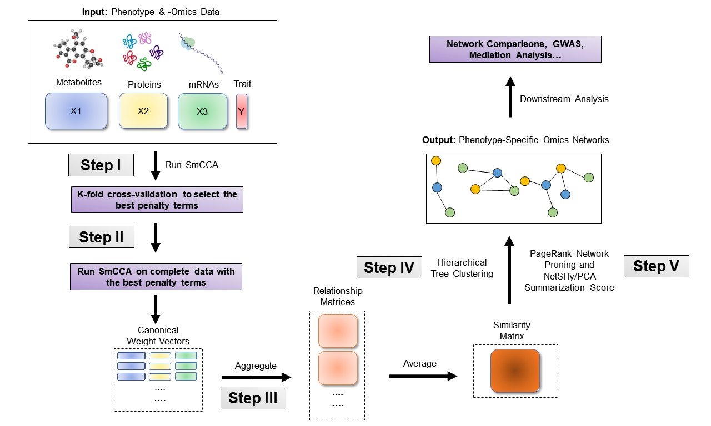
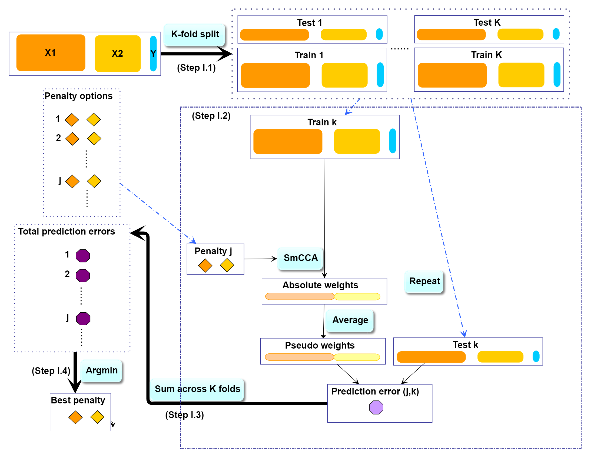

```{r setup, include=FALSE}
knitr::opts_chunk$set(echo = TRUE)
```


# SmCCNet overview
**Note:** if you use SmCCNet in published research, please cite:

> Liu, W., Vu, T., Konigsberg, I. R., Pratte, K. A., Zhuang, Y., & Kechris, K. J. (2023). SmCCNet 2.0: an Upgraded R package for Multi-omics Network Inference. bioRxiv, 2023-11.

> Shi, W. J., Zhuang, Y., Russell, P. H., Hobbs, B. D., Parker, M. M., Castaldi, P. J., ... & Kechris, K. (2019). Unsupervised discovery of phenotype-specific multi-omics networks. Bioinformatics, 35(21), 4336-4343.


## Workflow

SmCCNet is a canonical correlation based integration method that reconstructs phenotype-specific multi-omics networks (Shi et al., 2019). The algorithm is based on sparse multiple canonical analysis (SmCCA) for $T$ omics data $X_1, X_2,...X_T$ and a quantitative phenotype $Y$ measured on the same subjects. SmCCA finds the canonical weights $w_1, w_2,...,w_T$ that maximize the (weighted or unweighted) sum of pairwise canonical correlations between $X_1, X_2, ..., X_T$ and $Y$, under some constraints (Equation \ref{eq:smcca2}). In SmCCNet, the sparsity constraint functions $P_t(\cdot), t = 1,2,...,T$, are the least absolute shrinkage and selection operators (LASSO). The weighted version corresponds to $a_{i,j}, b_{i}$ (also called scaling factors), are not all equal; the unweighted version corresponds to $a_{i,j} = b_i = 1$ for all $i,j = 1,2,..., T$.

\begin{equation}
\begin{split} 
\label{eq:smcca2}
& (w_1, w_2,...,w_T)\!  =\! \arg\max_{\tilde w_1, \tilde w_2,..., \tilde w_T} \!\left(\sum_{i<j;i,j=1,2,...,T} \!a_{i,j}\tilde w_i^TX_i^TX_j\tilde w_j\! +\! \sum_{i=1}^{T}b_{i}  \tilde w_i^TX_i^TY\!\right),\\
&  \hspace{.2in}\text{subject to } \lVert\tilde w_t\rVert^2 = 1, P_t(\tilde w_t) \leq c_t, t = 1,2,...,T.			
\end{split}
\end{equation}


The sparsity penalties $c_t$ influence how many features will be included in each subnetwork. With pre-selected sparsity penalties, the SmCCNet algorithm creates a network similarity matrix based on SmCCA canonical weights from repeated subsampled omics data and the phenotype, and then finds multi-omics modules that are relevant to the phenotype. The subsampling scheme improves network robustness by analyzing a subset of omics features multiple times and forms a final similarity matrix by aggregating results from each subsampling step. The general workflow (Figure \ref{fig:flowchart}) involves three steps:

- Step I: Determine SmCCA sparsity penalties $c_t$. The user can select the penalties for omics feature selection based on the study purpose and/or prior knowledge. Alternatively, one can pick sparsity penalties based on a K-fold cross validation (CV) procedure that minimizes the total prediction error (Figure \ref{fig:CVflow}). The K-fold CV procedure ensures selected penalties to be generalizable to similar independent data sets and prevents over-fitting. 
- Step II: Randomly subsample omics features without replacement, apply SmCCA with chosen penalties, and compute a feature relationship matrix for each subset. Repeat the process many times and define the similarity matrix to be the average of all feature relationship matrices. 
- Step III: Apply hierarchical tree cutting to the similarity matrix to find the multi-omics networks. This step simultaneously identifies multiple subnetworks.


```{r flowchart, fig.cap = "SmCCNet workflow overview for Quantitative Phenotype. X1, X2, and X3 are three omics data types for the same set of n subjects. Y indicates a quantitative phenotype measure for those n subjects. Note that the flowchart demonstrate workflow for three omics data, it is also compatible with more than three omics data or two omics data.", echo = FALSE,out.width='100%'}

```


## SmCCNet package

The SmCCNet package has the following dependencies: 

```{r, echo = FALSE, results = "hide", warning = FALSE, eval = TRUE}
suppressPackageStartupMessages({
    library(pbapply)
    library(Matrix)
    library(igraph)
    library(furrr)
    library(future)
})
```
```{r, eval = TRUE}
library(pbapply)
library(Matrix)
library(igraph)
library(SmCCNet)
library(furrr)
library(future)
```

<!-- The SmCCNet package consists of two R scripts: -->
<!-- ```{r source, eval = TRUE} -->
<!-- source("../R/ModifiedPMA.R") -->
<!-- source("../R/SmCCNetSource.R") -->
<!-- ``` -->


The older version of the SmCCNet package includes four (external) functions: 

- **getRobustPseudoWeights()**: Compute aggregated (SmCCA) canonical weights. 
- **getAbar()**: Calculate similarity matrix based on canonical weights.
- **getMultiOmicsModules()**: Perform hierarchical tree cutting on the similarity matrix and extract clades with multi-omics features.
- **plotMultiOmicsNetwork()**: Plot (pruned or full) multi-omics subnetworks. 

In the updated package, all functions except for **getAbar** are retired from the package, additional functions have been added to the package to perform single-/multi-omics SmCCNet with quantitative/binary phenotype, and their use is illustrated in this vignette:

- **aggregateCVSingle()**: Saving cross-validation result as the cross-validation table into the working directory and provide recommendation on the penalty term selection.
- **classifierEval()**: Evaluate binary classifier's performance with respect to user-selected metric (accuracy, auc score, precision, recall, f1).
- **dataPreprocess()**: A simple pipeline to preprocess the data before running SmCCNet (center, scale, coefficient of variation filtering and regressing out covariates).
- **fastAutoSmCCNet()**: Automated SmCCNet automatically identifies the project problem (single-omics vs multi-omics), and type of analysis (CCA for quantitative phenotype vs. PLS for binary phenotype) based on the input data that is provided. This method automatically preprocess data, choose scaling factors, subsampling percentage, and optimal penalty terms, then runs through the complete SmCCNet pipeline without the requirement for users to provide additional information. This function will store all the subnetwork information to a user-provided directory, as well as return all the global network and evaluation information. Refer to the automated SmCCNet vignette for more information.
- **getCanWeightsMulti()**: Run Sparse Multiple Canonical Correlation Analysis (SmCCA) and return canonical weight.
- **getCanCorMulti()**: Get canonical correlation value for SmCCA given canonical weight vectors and scaling factors.
- **getRobustWeightsMulti()**: SmCCNet algorithm with multi-omics data and quantitative phenotype. Calculate the canonical weights for SmCCA.
- **getRobustWeightsMultiBinary()**: SmCCNet algorithm with multi-omics data and binary phenotype. First, SmCCA is used to identify relationship between omics (exlude phenotype). Then, after highly connected omics features are selected in step 1, SPLSDA is used to identify relationships between these omics features and phenotype(s). The sparse PLSDA algorithm for binary outcome first compute PLS by assuming outcome is continuous, and extracts multiple latent factors, then uses latent factors to fit the logistic regression, and weights latent factor by regression parameters.
- **getRobustWeightsSingle()**: Compute aggregated (SmCCA) canonical weights for single omics data with quantitative phenotype. 
- **getRobustWeightsSingleBinary()**: Compute aggregated (SmCCA) canonical weights for single omics data with binary phenotype. 
- **getOmicsModules()**: Perform hierarchical tree cutting on the similarity matrix and extract clades with omics features. 
- **networkPruning()**: Extract summarization scores (the first 3 NetSHy/regular prinicipal components) for specified network module with given network size. The omics features will be ranked based on PageRank algorithm, then the top $m$ omics features (where $m$ is the specified subnetwork size) will be included into the final subnetwork to generate the summarization score. For the PC score, the correlation with respect to the phenotype of interest will be calculated and stored. In addition, the correlation between individual omics features and the detected phenotype (with the **Pheno** argument) will also be recorded. The final subnetwork adjacency matrix will be stored into the user-specified working directory of interest.
- **scalingFactorInput()**: After inputing the annotation of omics data, it uses prompts to ask the user to supply the scaling factor intended for the SmCCNet algorithm to prioritize the correlation structure of interest. All scaling factor values supplied should be numeric and nonnegative.
- **summarizeNetSHy()**: Implement NetSHy network summarization via a hybrid approach to summarize network by considering the network topology with the Laplacian matrix.
 

More details on above functions can be found in the package manual.


# SmCCNet workflow with a synthetic dataset

## Synthetic dataset

As an example, we consider a synthetic data set with 500 genes $(X_1)$ and 100 miRNAs $(X_2)$ expression levels measured for 358 subjects, along with a quantitative phenotype $(Y)$.

```{r example data}
data(ExampleData)
head(X1[ , 1:6])
head(X2[ , 1:6])
head(Y)
```

Denote the number of features in $X_1 \& X_2$ as $p_1 \& p_2$ respectively, and the number of subjects as $n$.
```{r p1p2, eval = TRUE}
p1 <- ncol(X1)
p2 <- ncol(X2)
n <- nrow(X1)
AbarLabel <- c(colnames(cbind(X1, X2)))
```

Although SmCCNet does not require normality, it calculates the Pearson correlation between linear combinations of omics features and the phenotype, which assumes finite variances and finite covariance. It is necessary to include a transformation if the data are skewed. The algorithm also requires the data to be standardizable (i.e. none of the data matrices include a column with zero variance.) 

## Step I. Preprocessing 

The first step is to preprocess the single omics data. All canonical correlation analysis (CCA) methods require data sets to be standardized (centered and scaled) by columns (e.g. features) to ensure the equivalent contribution of each feature when maximizing covariance. In addition, there are some other optional steps to preprocess the data. Note that when employing both standardization and covariate adjustment, it is essential to apply standardization prior to covariate adjustment. This sequencing ensures our best efforts to meet the assumptions of linear regression. In our data preprocessing pipeline, the following options are given:

- **CoV Filtering**: Filter features based on coefficients of variation (CoV).
- **Standardization**: Center and/or scale data.
- **Adjust for Covariates**: Regress out specified covariates and return residuals

Below is an example of data preprocessing with only feature filtering and standardization, in this case, there is no covariate adjustment, the coeffcient of variation filtering quantile is 0.2 (meaning that features with CoV smaller than 20% quantile of CoV will be filtered out), and data are centered and scaled:


```{r, eval = FALSE}
# define data list
X <- list(X1, X2)
# preprocess data
processed_data <- lapply(X, function(Xmatrix){
  as.matrix(dataPreprocess(X = as.data.frame(Xmatrix), covariates = NULL, 
                  is_cv = TRUE, cv_quantile = 0.2, center = TRUE, 
                 scale = TRUE))})
# re-standardize -omics data if regress-out approach is used (covariates != NULL)
processed_data <- lapply(processed_data, scale)
# if preprocess feature is used, X need to be overrided with the following code 
X <- processed_data
```

## Step II: Determine optimal sparsity penalties through cross-validation (optional)

For two omics data, to find the optimal sparsity penalties $c_1, c_2$, we apply a K-fold CV on the synthetic data (Figure \ref{fig:CVflow}). Note that under LASSO constraints, $1\leq c_1\leq\sqrt{p_1s_1}, 1\leq c_2\leq\sqrt{p_2s_2}$, where $p_1,p_2$ denote the number of features in omics data $X_1, X_2$ respectively, and $s_1, s_2$ are the proportions of $X_1, X_2$ features to be sampled every time. The sparse penalties $c_1, c_2$ can be re-parametrized as $0<l_1, l_2\leq1$, such that $c_1 = \max\{1, l_1\sqrt{p_1s_1}\}, c_2 = \max\{1, l_2\sqrt{p_2s_2}\}$. Large penalty values correspond to more features in each subnetwork, while small penalties correspond to fewer features. Here is the list of parameters that need to be specified to perform a grid search for the penalty parameters:

- $K$: Number of folds in CV. Typically a 5-fold CV is sufficient. If the training set contains too few (e.g. $<30$) samples, or the test or training set becomes unscalable, then choose a smaller $K$.
- $CCcoef:$ Coefficients, $(a_{i,j}, b_{i})$ in Equation \ref{eq:smcca2}, for the weighted SmCCA. It can be either supplied manually or interatively (see code below).
- $PenExpand$: A penalty option matrix for $X_1, X_2$. Each row of $PenExpand$ is a pair of penalty options $l = (l_1, l_2)$, where $0<l_1, l_2<1$. Larger penalties correspond to more features to be included in each subnetwork. Typically, it is not necessary to search the entire range (0, 1), and a smaller grid (e.g. $0<l_1, l_2<.5$) may be sufficient. 
- $X$ A list of omics data, where each omics data should contain same set and order of subjects.
- $num\_omics$ The total number of omics data in $X$.
- $tuneLength$ The total number of candidate penalty terms for each penalty parameter.
- $minTune$ The minimumally possible value for penalty parameters.
- $maxTune$ The maximally possible tuning value for penalty parameters.

```{r CVflow, fig.cap = "SmCCNet K-fold CV. The best penalty pairs are chosen based on the smallest total prediction error.", echo = FALSE, out.width='100%'}

```

In all the code chunks below, if a user plans to use more than 2 omics data, please change the code accordingly where a $**$ is marked on the comment line:

```{r CVpara, warning = FALSE, eval = FALSE}
# number of folds in K-fold CV.
K <- 3 
N <- nrow(X1)
# create a list of omics data **
X <- list(X1, X2)
# number of omics dataset **
num_omics <- 2
# tuning parameter candidate length for each omics data
tuneLength <- 5
# tuning parameter candadate range for each omics data
minTune <- 0.1
maxTune <- 0.5
# create empty matrix to store all possible penalty parameters
penSelect <- matrix(0, nrow = tuneLength, ncol = num_omics)
# create sparsity penalty options.
for (Idx in 1:ncol(penSelect))
{
  penSelect[,Idx] <- seq(from = minTune, 
                         to = maxTune, 
                         length.out = tuneLength)
}
# expand grid
# convert matrix to list of columns
list_cols <- as.list(as.data.frame(penSelect))
# generate all possible combinations
PenExpand <- do.call(expand.grid, list_cols)

# set a CV directory.
CVDir <- "Example3foldCV/" 
dir.create(CVDir)
```

### Create test and training data sets. 
First, we need to split the data ($X_1, X_2, Y$) into test and training sets (Figure \ref{fig:CVflow}, Step I.1). All CCA methods require data sets to be standardized (centered and scaled) by columns (e.g. features). We have included the standardization step within the SmCCNet algorithm. However, for the CV procedure, we recommend to standardize the training and test sets upfront, since this helps to choose the number of CV folds $K$. If any data set can not be standardized, we recommend to reduce $K$. In the code below, we show how to create CV data sets. The standardized training and test data sets will be saved under the "Example3foldCV/" directory.

```{r make K-fold quantitative, eval = FALSE}
set.seed(12345) # set random seed.

# split data into folds
foldIdx <- suppressWarnings(split(1:nrow(X[[1]]), sample(1:nrow(X[[1]]), K)))
folddata <- purrr::map(1:length(foldIdx), function(x){
    Y <- as.matrix(Y)
    X_train <- list()
    X_test <- list()
    Y_train <- list()
    Y_test <- list()
    for (i in 1:length(X))
    {
      X_train[[i]] <- scale(X[[i]][-foldIdx[[x]],])
      X_test[[i]] <- scale(X[[i]][foldIdx[[x]],])
    }
    Y_train <- scale(Y[-foldIdx[[x]],])
    Y_test <- scale(Y[foldIdx[[x]],])
    return(list(X_train = X_train, X_test = X_test,Y_train = Y_train, 
                Y_test = Y_test))
})
# name each fold of data
names(folddata) <- paste0('Fold_', 1:K)
# saving all preliminary data into local directory for reproducibility purpose
save(folddata, PenExpand, 
       file = paste0(CVDir, "CVData.RData"))
```

### Set Scaling Factors

It is important to set scaling factors $a_{i,j}$'s and $b_{i}$'s for each pairwise correlation to prioritize correlation structure(s) of interest. Below is the function that prompts the user to define the scaling factor intended for the analysis: default is (1,1,1) for two omics if the first line of code below is run. If the user prefers to set up scaling factors in different ways such as (1,10,10) where 10 is set for omics-phenotype correlation to emphasize the omics-phenotype correlation, the user can use the interactive function below. This is especially effective when  more than two omics data are used since the order of pairwise combinations can be extremely complicated. Note that the argument (DataType) for interactive function below should strictly follow the order of the data list used for SmCCA computation, followed by 'phenotype'. For instance, in the example data, $X_1$ stands for mRNA, $X_2$ stands for miRNAs, then the order of the argument is set to ('mRNA', 'miRNA', 'phenotype'). In the example below, we use $(1,1,1)$ as the scaling factor to demonstrate the result.

```{r set scaling factors, eval = FALSE}
# default
scalingFactor <- rep(1,ncol(combn(num_omics + 1,2)))
# interactive **
scalingFactor <- scalingFactorInput(DataType = c('mRNA', 'miRNA', 'phenotype'))
```


### Run K-fold CV

For each of the K-folds, we compute the prediction error for each penalty pair option (Figure \ref{fig:CVflow}, Step I.2). Since there is no subsampling step for cross-validation, we run through cross-validation with nested for loop. However, if the omics data are extremely high-dimensional, we recommend using the R package **parallel** to parallelize the for loop, or use **fastAutoSmCCNet()** directly. **fastAutoSmCCNet()** is the package built-in function that streamline the pipeline with single line of code, and the cross-validation step is parallelized with **future_map()** in the **furrr** package.  


```{r run CV, eval = FALSE}
# load cross-validation data
load(paste0(CVDir, "CVData.RData"))
# create an empty list for storing CV result for each fold
CVResult <- list()
for (CVidx in 1:K)
{  
    # set scaling factor
    CCcoef <- scalingFactor
    # create empty vector for storing cross-validation result
    RhoTrain <- RhoTest <- DeltaCor <- rep(0, nrow(PenExpand))
    for(idx in 1:nrow(PenExpand))
    {
      # consider one pair of sparsity penalties at a time.
      l <- PenExpand[idx, ]
      # run SmCCA on the subsamples (Figure 1, Step II)
      Ws <- getCanWeightsMulti(folddata[[CVidx]][["X_train"]], 
                           Trait = as.matrix(folddata[[CVidx]][["Y_train"]]), 
                           Lambda = as.numeric(l), NoTrait = FALSE, 
                           CCcoef = CCcoef)
      # evaluate the canonical correlation for training and testing data
      rho.train <-  getCanCorMulti(X = folddata[[CVidx]][["X_train"]], 
                                Y = as.matrix(folddata[[CVidx]][["Y_train"]]), 
                                CCWeight = Ws, 
                                CCcoef = CCcoef)
      rho.test <-  getCanCorMulti(X = folddata[[CVidx]][["X_test"]], 
                                Y = as.matrix(folddata[[CVidx]][["Y_test"]]), 
                                CCWeight = Ws, 
                                CCcoef = CCcoef)

      # store cv result  
      RhoTrain[idx] <- round(rho.train, digits = 5)
      RhoTest[idx] <- round(rho.test, digits = 5)
      DeltaCor[idx] <- abs(rho.train - rho.test)
    
    }
    
    # record prediction errors for given CV fold and all sparsity penalty 
    # options.
    CVResult[[CVidx]] <- cbind(RhoTrain, RhoTest, DeltaCor)
}
```


### Extract penalty pair with the smallest total prediction error

Finally, we extract the total prediction errors  (Figure \ref{fig:CVflow}, Step I.3) and conclude the best penalty pair from the grid search as the pair with the smallest error (Figure \ref{fig:CVflow}, Step I.4). There are different ways to select the 
best penalty terms, one of the simplest way is to minimize discrepancy between the training canonical 
correlation and the testing canonical correlation. However, this method does not take the magnitude of 
testing canonical correlation into account, which means it may end up selecting the penalty term with smaller 
canonical correlation (low signal). For instance, if a certain penalty term yields the training canonical correlation of 0.7, with the testing canonical correlation of 0.4, and another penalty term yield the training canonical correlation of 0.4, with the testing canonical correlation of 0.2, minimizing training and testing canonical correlation selects the latter. Therefore, in this step, we want to minimized the scaled prediction error, which is defined as:

\begin{equation}
scaledPredErr = \frac{|trainCC - testCC|}{|testCC|},
\end{equation}

where $trainCC$ and $testCC$ is defined as the training canonical correlation and testing canonical correlation respectively. Below is the aggregated cross-validation evaluation result:


```{r aggregate error, eval = FALSE}
# aggregate CV result and select the best penalty term
AggregatedCVResult <- Reduce("+", CVResult) / length(CVResult)
# calculate the evaluation metric of interest
EvalMetric <- apply(AggregatedCVResult, 1, function(x) {x[3]/abs(x[2])})
# determine the best CV result
optIdx <- which.min(EvalMetric)
```


We can visualize the scaled prediction errors with a contour plot (Figure \ref{fig:contourPlot}), note that this method only works for two omics data, if more than two omics data are used, please construct contour plot for each pair of omics data respectively. 

```{r contour, eval = FALSE}
library(plotly)
library(reshape2)
f1 <- list(
  family = "Arial, sans-serif",
  size = 20,
  color = "black"
)
f2 <- list(
  family = "Old Standard TT, serif",
  size = 20,
  color = "black"
)
a <- list(
  title = "l1",
  titlefont = f1,
  showticklabels = TRUE,
  tickfont = f2
)
b <- list(
  title = "l2",
  titlefont = f1,
  showticklabels = TRUE,
  tickfont = f2
)
# create melt data
PenExpandMelt <- cbind(PenExpand[,c(1,2)], EvalMetric)
colnames(PenExpandMelt)[c(1,2)] <- c('l1', 'l2')
hmelt <- melt(PenExpandMelt, id.vars = c("l1", "l2"))
contourPlot <- plot_ly(hmelt, x = ~l1, y = ~l2, z = ~value, 
                       type = "contour") %>%
  layout(xaxis = a, yaxis = b, showlegend = TRUE, legend = f1)  
# orca preinstalltion is required for next step: 
# https://github.com/plotly/orca#installation
contourPlot
```


```{r contourPlot, fig.cap = "Total scaled prediction error contour plot for evaluation metric (defined as prediction error/test cc). The x- and y-axes indicate LASSO penalties considered for mRNA and miRNA, respectively. Blue to yellow scale indicates increasing total scaled prediction error.", echo = FALSE, out.width = '100%'}

```


For the synthetic data set, the optimal penalty pair that gives the smallest prediction error is $(l_1, l_2) = (0.1, 0.1)$.
```{r best pen, eval = FALSE}
# combine CV evaluation result with penalty candidates 
overallCVInfo <- cbind(PenExpand, AggregatedCVResult, scaledPredError = EvalMetric)
# set column names for penalty terms 
colnames(overallCVInfo)[1:num_omics] <- paste0('l',1:num_omics)
# save overall CV result 
write.csv(overallCVInfo, file = paste0(CVDir, 'overallCVInfo.csv'), 
          row.names = FALSE)
# print out the best CV penalty pair and associated result
print(overallCVInfo[optIdx,])
```

Table \ref{tab:errorTable} shows the total prediction error (scaledPredError) for all penalty options. Note that in this example, we are only including 25 optional penalty pairs. The fourth column (RhoTest) records the aggregated canonical correlations for the test data set.

```{r errorTable, echo = FALSE, eval = TRUE}
knitr::kable(read.csv("../vignettes/results/overallCVInfo.csv"), caption = "Total Prediction Error from a 3-fold CV for the synthetic dataset")
```


## Step III: Run SmCCA with pre-selected penalty term

With a pre-selected penalty pair, we apply SmCCA to subsampled features of $X_1, X_2$ and $Y$, and repeat the process to generate a robust similarity matrix (Figure \ref{fig:flowchart}, Step II). As for the number of subsamples, a larger number of subsamples leads to more accurate results, while a smaller number of subsamples is faster computationally. We use 50 in this example. In general, we recommend to subsample 500-1000 times or more. Below is the setup and description of the subsampling parameters:

- $s = (s_1,s_2)$: Proportions of feature subsampling from $X_1, X_2$. Default values are $s_1 = 0.7, s_2 = 0.9.$
- $SubsamplingNum$: Number of subsamples.

After obtaining the canonical
weight $Ws$, which has the dimension of $p_1 + p_2$ (total number of features) by $p_1 s_1 + p_2 s_2$ (number of feature subsamples), the next step is to obtain the adjacency matrix by taking the outer product of each $W$ with itself to obtain an adjacency matrix and average the matrices to obtain $Abar$, a sparse matrix object (illustrate in the next section).

```{r get abar, eval = FALSE}
# feature sampling proportions, 0.9 for miRNA since it has less features. **
s <- c(0.7,0.9) 
# number of subsamples.
SubsamplingNum <- 50
# run SmCCA on the subsamples (Figure 1, Step II)
Ws <- getRobustWeightsMulti(X, 
                        Trait = as.matrix(Y), 
                        NoTrait = FALSE,CCcoef = scalingFactor,
                        Lambda = as.numeric(overallCVInfo[optIdx,1:num_omics]),
                        s = s, 
                        SubsamplingNum = SubsamplingNum)
```


## Step IV: Obtain multi-omics modules through network clustering

From the canonical weights obtained in the last step, we can get multi-omics modules by constructing global adjacency matrix and applying hierarchical tree cutting and plotting the reconstructed networks (Figure \ref{fig:flowchart}). The edge signs are recovered from pairwise feature correlations when visualizing the network. 

```{r get modules, eval = FALSE}
# construct adjacency matrix
Abar <- getAbar(Ws, FeatureLabel = AbarLabel)
# perform clustering based on the adjacency matrix Abar 
OmicsModule <- getOmicsModules(Abar, PlotTree = FALSE)
save(Ws, Abar, OmicsModule, file = paste0(CVDir, "SmCCNetWeights.RData"))
```

## Step V: Obtain network summarization score and pruned subnetworks

The next step is to prune the network so that the unnecessary features (nodes) will be filtered from the original network module. This principle is based on a subject-level score of interest known as the network summarization score. There are two  different network summarization methods: PCA and NetSHy (network summarization via a hybrid approach, Vu et al 2023 Bioinformatics), which are specified by the argument 'method'. We evaluate two criteria stepwise 1) summarization score correlation with respect to the phenotype, which is used to verify if the summarization score for the current subnetwork has a strong signal  with respect to the phenotype and 2) The correlation between the summarization of the current subnetwork and that of the baseline network with a pre-defined baseline network size. This is used to check if the addition of more molecular features introduces noise. The stepwise approach for network pruning is:

\begin{itemize}
\item Calculate PageRank score for all molecular features in global network, and rank them according to PageRank score.
\item Start from minimally possible network size $m_1$, iterate the following steps until reaching the maximally possible network size $m_2$
 (defined by users):\begin{itemize}
 \item Add one more molecular feature into the network based on node ranking, then calculate NetSHy/PCA summarization score (PC1 - PC3) for this updated network.
 \item Calculate the correlation between this network summarization score and phenotype for all the possible network size $i \in [m_1,m_2]$, and only use PC with the highest (determined by absolute value) w.r.t. phenotype, define this correlation as $\rho_{(i,pheno)}$, where $i$ stands for the current network size.
 \end{itemize}
  \item Identify network size $m_*$ ($m_* \in [m_1, m_2]$) with $\rho_{(m_*, pheno)}$ being the maximally possible summarization score correlation w.r.t. phenotype (determined by absolute value).
\item Treat $m_*$ as the new baseline network size, let $\rho_{(m_*,i)}$ be the correlation of summarization score between network with size $m_*$ and network with size $i$. Define $x$ to be the network size ($x \in [m_{*}, m_2]$), such that $x = \max \{ i| (i \in [m_*, m_2])  \& (|\rho_{(m_{*},i)}| > 0.8) \}$.
\item Between network size of $m$ and $x$, the optimal network size $m_{opt}$ is defined to be the maximum network size such that $|\rho_{m_{(opt, pheno)}}| \geq 0.9 \cdot |\rho_{(m,pheno)}|$.
\end{itemize}


In the following example, the summarization used is the first 3 NetSHy principal components. After clustering, there are 6 network modules, with only 1 network module having more than 10 nodes. The optimal network size after network pruning is 18. The output from this steps contains a network adjacency matrix, summarization scores (first 3 NetSHy PCs), PC loadings and more, which are stored in a .Rdata file in the user specified location. 

```{r plotNet, eval = FALSE}
# make sure there are no duplicated labels
AbarLabel <- make.unique(AbarLabel)

# create concatenate omics data for network pruning
X_big <- cbind(X1,X2)

# calculate feature correlation matrix
bigCor2 <- cor(X_big)

# data type
types <- c(rep('gene', ncol(X1)), rep('mirna', ncol(X2)))

# filter out network modules with insufficient number of nodes
module_length <- unlist(lapply(OmicsModule, length))
network_modules <- OmicsModule[module_length > 10]
# extract pruned network modules
for(i in 1:length(network_modules))
{
  cat(paste0('For network module: ', i, '\n'))
  # define subnetwork
  abar_sub <- Abar[network_modules[[i]],network_modules[[i]]]
  cor_sub <- bigCor2[network_modules[[i]],network_modules[[i]]]
  # prune network module
  networkPruning(Abar = abar_sub,CorrMatrix = cor_sub, 
                          type = types[network_modules[[i]]], 
                 data = X_big[,network_modules[[i]]],      
			  Pheno = Y, ModuleIdx = i, min_mod_size = 10, 
                          max_mod_size = 100, method = 'NetSHy', 
                          saving_dir = CVDir)
}
```

# Results

We present the network result based on the synthetic data. The first table below contains the individual molecular features correlation with respect to phenotype, and their associated p-value (from correlation testing).

```{r, eval = TRUE,echo = FALSE, warning = FALSE, message = FALSE}
load('../vignettes/results/multi_omics_quant_size_18_net_1.Rdata')
row.names(omics_correlation_data) <- NULL
colnames(omics_correlation_data) <- c('Molecular Feature', 'Correlation to Phenotype', 'P-value')
knitr::kable(omics_correlation_data, caption = 'Individual molecular features correlation table with respect to phenotype (correlation and p-value).')
```


```{r loadings1, echo = FALSE, warning = FALSE, message = FALSE, out.width="100%", fig.cap = "PC1 loading for each subnetwork feature."}
library(grid)
library(tidyverse)
library(shadowtext)
library(reshape2)
BLUE <- "#076fa2"
data <- data.frame(name = row.names(pc_loading), loading = abs(pc_loading[,1]))
plt <- ggplot(data) +
  geom_col(aes(loading, name), fill = BLUE, width = 0.6) 

plt
```

```{r corheatmap, echo = FALSE, warning = FALSE, message = FALSE, out.width="100%", fig.cap = "Correlation heatmap for subnetwork features."}
###### Correlation heatmap
melted_cormat <- melt(correlation_sub)
ggplot(data = melted_cormat, aes(x=Var1, y=Var2, fill=value)) + 
  geom_tile() +
   labs(title = "Correlation Heatmap of Network Features") + 
  theme(plot.title.position = "plot")
```

```{r adjheatmap, echo = FALSE, warning = FALSE, message = FALSE, out.width="100%", fig.cap = "Adjacency matrix heatmap for subnetwork features."}
###### Correlation heatmap
melted_cormat <- melt(as.matrix(M))
ggplot(data = melted_cormat, aes(x=Var1, y=Var2, fill=value)) + 
  geom_tile() +
   labs(title = "Adjacency Matrix Heatmap of Network Features") + 
  theme(plot.title.position = "plot")

```

Figure \ref{fig:loadings1} is the visualization of the PC loadings that contribution of each molecular features to the first NetSHy PC. In addition, there are two network heatmaps based on (1) correlation matrix (Figure \ref{fig:corheatmap}), and (2) adjacency matrix (Figure \ref{fig:adjheatmap}). Based on the summarization table, genes 1,2,6,7, and miRNA 2 have relatively high correlation with respect to phenotype. The PC loadings also confirm that genes 6,7, and miRNA 2 and generally have higher PC contribution. From the correlation heatmap, we do not observe associations between molecular features, but for the adjacency matrix heatmap, we observe the higher connections between genes 6,7 and miRNA 2. We also recommend experimenting more PCs (up to 3) with Figure \ref{fig:loadings1} to demonstrate the contribution of molecular features to each PC.

## Step VI: Visualize network module

The initial approach to network visualization is facilitated through our SmCCNet shinyApp, accessible at [https://smccnet.shinyapps.io/smccnetnetwork/](https://smccnet.shinyapps.io/smccnetnetwork/). Upon obtaining a subnetwork file named 'size_a_net_b.Rdata', users can upload it to the shinyApp. The platform provides various adjustable visualization parameters, enabling users to tailor the network visualization to their preferences.

An alternative way to visualize the final network module, we need to download the Cytoscape software (Shannon et al., 2003), and use the package RCy3 to visualize the subnetwork generated from the network pruning step. In general, since the network obtained through the PageRank pruning algorithm is densely connected, and some of the edges may be false positive (meaning that two nodes are not associated, but with higher edge values in the adjacency matrix). Therefore, we use the correlation matrix to filter out those weak network edges.

In the network visualization (Figure \ref{fig:netPlot}),  different colored edges denote  different directions of the association between two nodes, where red or blue denotes a positive or negative association respectively. The width of the edge represents the connection strength between two nodes. 


```{r, eval = FALSE}
library(RCy3)
library(igraph)
# load subnetwork data (example, user need to provide the directory)
load('ResultDirectory/size_a_net_b.Rdata')
M <- as.matrix(M)
correlation_filter <- 0.05
# correlation matrix filtering for the subnetwork edge-cut
filter_index <- which(abs(correlation_sub) < correlation_filter)
M_ind <- ifelse(correlation_sub > 0, 1, -1)
M_adj <- M * M_ind
M_adj[filter_index] <- 0
diag(M_adj) <- 0

# network visualization through cytoscape
graph <- igraph::graph_from_adjacency_matrix(M_adj, mode = 'undirected', 
         weighted = TRUE, diag = TRUE, add.colnames = NULL, add.rownames = NA)

# define network node type and connectivity and use them in cytoscape
V(graph)$type <- sub_type
V(graph)$type
V(graph)$connectivity <- rowSums(abs(M))
V(graph)$connectivity
# export subnetwork to Cytoscape 
createNetworkFromIgraph(graph,"multi_omics_network")
```

```{r netPlot, out.width="100%", fig.cap = "Pruned module 1. The strength of the node connections is indicated by the thickness of edges. Red edges and blue edges are for negative and positive connections respectively. Red node represents genes, and blue node represent miRNAs.", echo = FALSE}

```


# Methods for Optimal Scaling Factors Selection

As shown above, the scaling factors must be supplied to prioritize correlation structure of interest. However, it is not always straightforward to determine the scaling factors. In the section below, we provide 3 different methods to select the scaling factors of interest.

## Method 1: Use Prompt to Define Scaling Factors

A common choice for the scaling factors is to prioritize the omics-phenotype correlation. For instance, in multi-omics quantitative phenotype analysis with 2 omics data, let $a_{1,2}$ be the scaling factor for omics-omics correlation, $b_{1}$ and $b_{2}$ be the scaling factors for omics-phenotype correlation, then a common choice of the scaling factor $(a_{1,2},b_1,b_2)$ is $(1,10,10)$. This can be done through manual entry with interactive function 'scalingFactorInput()', and the example is given in section 2.2.2.


## Method 2: Use Automated SmCCNet to Select Scaling Factors Based on Pairwise Correlation.

Another method is to check the pairwise correlation between each pair of omics data using sparse canonical correlation analysis (SCCA). We ran SCCA with the most stringent penalty pair ($0.1,0.1$), and calculate the canonical correlation. The canonical correlation calculated will be treated as the between-omics scaling factor, while scaling factor of 1 will be used for omics-phenotype relationship. In addition, we introduced another parameter called shrinkage factor to prioritize either omics-omics relationship or omics-phenotype relationship. For instance, in a multi-omics analysis with two omics data, if omics-omics correlation is 0.8, and the shrinkage parameter is 2, then the final scaling factors are set to $(a,b_1,b_2) = c(0.4, 1, 1)$. This method is currently only implemented in **fastAutoSmCCNet()**. If user want to use this method, please refer to the automated SmCCNet vignette.

## Method 3: Use Cross-Validation to Select Scaling Factors

Let's assume that there are two omics data mRNA and miRNA with a quantitative phenotype. We want to systematically evaluate the performance of each pair of scaling factors. The best way is to create candidate scaling factors set by setting all omics-omics scaling factor to 1, and varying the omics-phenotype scaling factors. To make performance comparable, we scale each set of scaling factors so that they sum up to 1. For instance, with the two omics example, the scaling factor $(a_{1,2}, b_1, b_2)$ should satisfy $a_{1,2} + b_1 + b_2 = 1$. We implement a nested grid search approach to select the best scaling factors along with the corresponding optimal penalty parameters. For each set of scaling factors, the sparse penalty parameters (l1, l2) were chosen through a K-fold cross validation to find the penalty pair that minimized the scaled prediction error, and the best scaled prediction error is recorded for each set of scaling factors and is used to find the optimal scaling factors. All penalty pairs from the set were also tested in a grid search to find the optimal pair (l1, l2). The penalty parameters determine how many miRNA (l1) and mRNA (l2) are in the final results. Scaling factors in the grid search were evaluated to identify which value yielded the best network results with a predefined criterion. We discuss the evaluation criterion in section 4.3.2.


### Cross validation with each set of scaling factors

Below is the penalty parameter grid search setup for the SmCCNet algorithm. Note that it is the same step as the section 2.2:


```{r CVpara tune, warning = FALSE, eval = FALSE}
# number of folds in K-fold CV.
K <- 3 
N <- nrow(X1)
# create a list of omics data
X <- list(X1, X2)
# number of omics dataset
num_omics <- 2
# tuning parameter candidate length for each omics data
tuneLength <- 5
# tuning parameter candadate range for each omics data
minTune <- 0.1
maxTune <- 0.5
# create empty matrix to store all possible penalty parameters
penSelect <- matrix(0, nrow = tuneLength, ncol = num_omics)
# create sparsity penalty options.
for (Idx in 1:ncol(penSelect))
{
  penSelect[,Idx] <- seq(from = minTune, 
                         to = maxTune, 
                         length.out = tuneLength)
}
# expand grid
# convert matrix to list of columns
list_cols <- as.list(as.data.frame(penSelect))
# generate all possible combinations
PenExpand <- do.call(expand.grid, list_cols)

# set a CV directory.
CVDir <- "Example3foldCVTune/" 
dir.create(CVDir)
```

Same as above, we split the original data into K different folds for evaluation: 


```{r make K-fold tune, eval = FALSE}
set.seed(12345) # set random seed.

# split data into folds
X <- lapply(X, scale)
foldIdx <- suppressWarnings(split(1:nrow(X[[1]]), sample(1:nrow(X[[1]]), K)))
folddata <- purrr::map(1:length(foldIdx), function(x){
    Y <- as.matrix(Y)
    X_train <- list()
    X_test <- list()
    Y_train <- list()
    Y_test <- list()
    for (i in 1:length(X))
    {
      X_train[[i]] <- X[[i]][-foldIdx[[x]],]
      X_test[[i]] <- X[[i]][foldIdx[[x]],]
    }
    Y_train <- Y[-foldIdx[[x]],]
    Y_test <- Y[foldIdx[[x]],]
    return(list(X_train = X_train, X_test = X_test,Y_train = Y_train, 
                Y_test = Y_test))
})
# name each fold of data
names(folddata) <- paste0('Fold_', 1:K)
# saving all preliminary data into local directory for reproducibility purpose
save(folddata, PenExpand,
       file = paste0(CVDir, "CVData.RData"))
```

Below is the function to set up the searching grid for scaling factors. There are 3 different arguments in this function:  

- $DataType$: The vector with each omics type annotated (in same order as $X$), followed by 'phenotype'.
- $tuneLength$: The length of candidate scaling factors for each pairwise combination.
- $tuneRangePheno$: A vector of length 2 with the first argument being the minimally possible scaling factor value, and the second argument being the maximally possible scaling factor value.


```{r, eval = FALSE}
# create a function that set up the scaling factor candidate grids
gridCCcoef <- function(DataType, tuneLength = 5, tuneRangePheno = c(1,10))
{
  # store the length of the data
  datalength <- length(DataType)
  phenotunelength <- datalength - 1
  # create empty matrix for storing the candidate scaling factors
  candCoef <- matrix(1, nrow = tuneLength^phenotunelength, 
                       ncol = ncol(utils::combn(datalength, 2)))
  # create storage empty grid
  phenoGrids <- matrix(0, nrow = tuneLength, 
                         ncol = phenotunelength)
  # create grids
  for (phenoIdx in 1:phenotunelength)
  {
    phenoGrids[,phenoIdx] <- seq(from = tuneRangePheno[1], 
                                 to = tuneRangePheno[2], 
                                 length.out = tuneLength)
  }
  # expand grid
  # convert matrix to list of columns
  list_cols <- as.list(as.data.frame(phenoGrids))
  # generate combinations
  phenoGridsExpand <- do.call(expand.grid, list_cols)
  candCoef[,which(utils::combn(datalength,2)[2,] == datalength)] <- as.matrix(
    phenoGridsExpand)
  # provide column names
  colnames(candCoef) <- apply(utils::combn(datalength,2),2, function(x){
      paste0(DataType[x[1]],'_', DataType[x[2]])
    })
  # scale scaling factors so that each set of scaling factors sum up to 1
  candCoef <- t(apply(candCoef, 1, function(x) {x/sum(x)}))
  return(candCoef)
    
}

# scaling factor grids
CCcoefMatrix <- gridCCcoef(c('mRNA','miRNA', 'pheno'), 
                           tuneLength = 3, tuneRangePheno = c(5,10))


# create data matrix to store the cross-validation result
CVEval <- matrix(0, nrow = nrow(CCcoefMatrix), ncol = num_omics + 
                   ncol(utils::combn(num_omics + 1, 2)) + 3)
CVEval[,1:ncol(utils::combn(num_omics + 1, 2))] <- CCcoefMatrix
colnames(CVEval)<- c( paste0('CCcoef:',  colnames(CCcoefMatrix)), 
                      paste0('l',1:num_omics), "TrainingCC", "TestCC", 
                                "CCPredError")
```  


In the example below, with two omics and a quantitative phenotype, we set the $tuneLength$ to 3, with the range of scaling factor to be between 5 and 10. Since there are a large number of candidate scaling factor pairs, to speed up the cross-validation step, the parallel computation can be implemented. 

```{r, eval = FALSE}
for (CCIdx in 1:nrow(CCcoefMatrix))
{
  coef <- CCcoefMatrix[CCIdx,]
  cat(paste0('Now running SmCCA for the scaling factor candidate ', 
             CCIdx, '\n'))

  future::plan(future::multisession, workers = K)
  CVResult <- furrr::future_map(1:K, function(CVidx) {  
    # set scaling factor
    CCcoef <- coef
    # create empty vector for storing cross-validation result
    RhoTrain <- RhoTest <- DeltaCor <- rep(0, nrow(PenExpand))
    for(idx in 1:nrow(PenExpand))
    {
      # consider one pair of sparsity penalties at a time.
      l <- PenExpand[idx, ]
      # run SmCCA on the subsamples (Figure 1, Step II)
      Ws <- getCanWeightsMulti(folddata[[CVidx]][["X_train"]], 
                           Trait = as.matrix(folddata[[CVidx]][["Y_train"]]), 
                           Lambda = as.numeric(l), NoTrait = FALSE, 
                           CCcoef = CCcoef)
      # evaluate the canonical correlation for training and testing data
      rho.train <-  getCanCorMulti(X = folddata[[CVidx]][["X_train"]], 
                                Y = as.matrix(folddata[[CVidx]][["Y_train"]]), 
                                CCWeight = Ws, 
                                CCcoef = CCcoef)
      rho.test <-  getCanCorMulti(X = folddata[[CVidx]][["X_test"]], 
                                Y = as.matrix(folddata[[CVidx]][["Y_test"]]), 
                                CCWeight = Ws, 
                                CCcoef = CCcoef)

      # store cv result  
      RhoTrain[idx] <- round(rho.train, digits = 5)
      RhoTest[idx] <- round(rho.test, digits = 5)
      DeltaCor[idx] <- abs(rho.train - rho.test)
    
    }
    
    # record prediction errors for given CV fold and all sparsity penalty 
    # options.
    DeltaCor.all <- cbind(RhoTrain, RhoTest, DeltaCor)
    return(DeltaCor.all)
  },.progress = TRUE,.options = furrr::furrr_options(seed = TRUE))
  cat('\n')
  # aggregate CV result and select the best penalty term
  AggregatedCVResult <- Reduce("+", CVResult) / length(CVResult)
  EvalMetric <- apply(AggregatedCVResult, 1, function(x) {x[3]/abs(x[2])})
  # determine the best CV result
  optIdx <- which.min(EvalMetric)
  # fill in the optimal penalty pair for current scaling scaling 
  # factor selection as well as the evaluation result
  CVEval[CCIdx,(ncol(utils::combn(num_omics + 1, 2))+
               1):ncol(CVEval)] <- c(as.numeric(PenExpand[optIdx,]),
                      as.numeric(AggregatedCVResult[optIdx,]))

  # write out the cross-validation result
  write.csv(CVEval, 
            file = paste0(CVDir, "/PredictionError.csv"), row.names = FALSE)
}
```


### Select optimal scaling factors with associated penalty parameters

Scaling constants in the grid search were evaluated to identify which values yielded the best network results. How to define a evaluation criterion depends on the interest of study. In the two omics example, the criterion is set to be:


\begin{eqnarray}
\begin{split}
\label{eq:scaling}
& (a_{1,2}, b_1, b_2)\!  =\! \arg\max_{\tilde a_{1,2}, \tilde b_1, \tilde c_2} \frac{|trainCC - testCC|}{|testCC|}	\end{split}
\end{eqnarray}


```{r, eval = FALSE}
# read in the overall cv result
evalResult <- read.csv(paste0(CVDir, "/PredictionError.csv"))
# find the optn
evalOptIdx <- which.min(evalResult$CCPredError/abs(evalResult$TestCC))
# print the optimal result 
evalResult[evalOptIdx,]
```


With the selected parameters of scaling factors (CCcoef), l1, and l2, we run SmCCNet on the entire dataset as Session 2.3 and identify the networks related to phenotype of interest as session 2.4. 


```{r get abar tune, eval = FALSE}
# feature sampling proportions, 0.9 for miRNA since it has less features.
s <- c(0.7,0.9) 
# number of subsamples.
SubsamplingNum <- 50
# run SmCCA on the subsamples (Figure 1, Step II)
Ws <- getRobustWeightsMulti(X, 
                        Trait = as.matrix(Y), 
                        NoTrait = FALSE,
                        CCcoef = as.numeric(evalResult[evalOptIdx, 
                                 1:ncol(utils::combn(num_omics + 1,2))]),
                        Lambda = as.numeric(evalResult[evalOptIdx,
                                (ncol(utils::combn(num_omics + 1, 2))
                                 +1):(ncol(utils::combn(num_omics + 
                                 1, 2))+num_omics)]), s = s, 
                        SubsamplingNum = SubsamplingNum)
```


# Multi-Omics SmCCNet with Binary Phenotype

```{r flowchart-binary, fig.cap = "SmCCNet workflow overview for Binary Phenotype. X1, X2, and X3 are three omics data types for the same set of n subjects. Y indicates a Binary phenotype measure for those n subjects. Note that the flowchart demonstrate workflow for three omics data, it is also compatible with more than three omics data or two omics data.", echo = FALSE,out.width='100%'}
knitr::include_graphics("figures/SmCCNet-Binary.jpg")
```


Consider $X_1, X_2, ..., X_T$ as $T$ omics datasets, and $Y$ as the phenotype data. The general workflow for multi-omics SmCCNet with binary phenotype is as follows (Figure \ref{fig:flowchart-binary}):

1. **Run Weighted/Unweighted Sparse Multiple Canonical Correlation Analysis (SmCCA)**: This is done on $X_1, X_2, ..., X_T$ (excluding phenotype data). The output is canonical weight vectors (with nonzero entries, zero entries are filtered) $\tilde W_{t} \in \mathbb{R}^{p_t^{(sub)} \times 1}, t = 1,2,...,T$, which represent the omics-omics connections. In this step, we filter out features that have no connections with other features, which helps reduce dimensionality. Note that we tend to set relaxed penalty terms for this step to include as many omics features as possible to increase the performance of the classifier in the next step.


2. **Subset Omics Data**: Each dataset $X_1, X_2, ..., X_T$ is subsetted to include only omics features selected in Step 1, call subsetted data $X_t(sub)\in \mathbb{R}^{n \times p_{t}^{(sub)}}$.

3. **Concatenate and Run Sparse Partial Least Squared Discriminant Analysis (SPLSDA) (Chung and Keles, 2010)**: The subsetted datasets $X_1(sub), X_2(sub),..., X_T(sub)$ are concatenated into $X(sub) = [X_1(sub), X_2(sub),...,X_T(sub)] \in \mathbb{R}^{n\times p}, p = \sum_{i = 1}^{T} p_i$. The Sparse PLSDA algorithm is then run to extract $R$ latent factors and projection matrix, by default, $R$ is set to 3. Projection matrix is defined as $P \in \mathbb{R}^{p^{(sub)} \times R}$. Latent factors are defined as $r = [r_1,r_2,...,r_R] = X(sub) \cdot P \in \mathbb{R}^{n \times R}$.


4. **Aggregate Latent Factors**: The $R$ latent factors are aggregated into one using logistic regression, defined by logit$(Y) = \alpha_1 r_1 + \alpha_2 r_2 + ... +\alpha_R r_R$. Estimate $\alpha$'s and report performance (e.g., accuracy/AUC score). Feature weights are given by aggregation of the projection matrix from Sparse PLSDA $W_{t}^{*} = P_{t} \cdot \alpha \in \mathbb{R}^{p_t^{(sub)} \times 1}, t = 1,2,...,T, \alpha = [\alpha_1, \alpha_2,....,\alpha_r] \in \mathbb{R}^{R \times 1}$, where $P_{t}$ is the subset of projection matrix $P$ such that it only includes features from the $t$th omics data.

5. **Normalize and Calculate Final Canonical Weight**: The feature weights $W_{1}^{*},W_{2}^{*},...,W_{T}^{*}$ based on sparse PLSDA are normalized to have an L2 norm of 1. Let $\gamma_1$ and $\gamma_2$ be two scalars representing the strength of omics-omics and omics-phenotype connections, respectively,then the final canonical weight is obtained by weighted combining the canonical weight from step 1 and the feature weight from classifier $W_{t} = \frac{\gamma_1}{\gamma_1+\gamma_2} \tilde W_{t} + \frac{\gamma_2}{\gamma_1+\gamma_2} W_{t}^{*}, t = 1,2,...,T$.


6. **Construct Multi-Omics Network and Perform Network Pruning**: A multi-omics network is constructed and pruned (same as multi-omics SmCCNet with quantitative phenotype).

Note that Steps 1-3 are repeated multiple times with different penalty pairs to select the best pair with cross-validation. The evaluation metric is maximizing the classification evaluation metric such as testing prediction accuracy or testing AUC score. Currently there are 5 different evaluation metrics to choose from: accuracy, AUC score, precision, recall, and F1 score, with accuracy as the default selection. For instance, if the phenotype is subject's disease status with possible values of 1 (disease-positive) and 0 (disease-negative), then below is the guidance on how to choose the best evaluation metric in this context:

\begin{itemize}

\item \textbf{Prediction Accuracy:} 
Use accuracy when both disease-positive and disease-negative subjects are almost even in number and equally important. It is a method that gives the percentage of all correct predictions out of all subjects.

\item \textbf{AUC Score:} 
The AUC evaluates the model's ability in distinguishing disease-positive from disease-negative subjects across varying thresholds when the predicted probability of a patient's disease status is given. It demonstrates the effectiveness in detecting disease-positive versus disease-negative subjects.

\item \textbf{Precision:} 
Precision is used when misclassifying a disease-negative subject as disease-positive has high consequences. It indicates the percentage of true disease-positive subjects among those predicted as disease-positive.

\item \textbf{Recall:} 
Recall is used when it's important to correctly classify as many disease-positive subjects as possible, even at the risk of misclassifying some disease-negative subjects. It tells the percentage of actual disease-positive subjects the model correctly spotted.

\item \textbf{F1 Score:} 
The F1 Score is the harmonic mean of precision and recall, ideal for uneven class distributions. We can think of it as the perfect blend of precision and recall in one number.

\end{itemize}


## Synthetic dataset

As an example, we consider a synthetic data set with 500 genes $(X_1)$ and 100 miRNAs $(X_2)$ expression levels measured for 358 subjects, along with a binary phenotype created by binarizing quantitative phenotype $(Y)$ based on median.

```{r example data binary}
data(ExampleData)
head(X1[ , 1:6])
head(X2[ , 1:6])
# binarize phenotype variable
Y <- ifelse(Y > median(Y), 1, 0)
head(Y)
```

Denote the number of features in $X_1 \& X_2$ as $p_1 \& p_2$ respectively, and the number of subjects as $n$.
```{r p1p2 binary, eval = TRUE}
p1 <- ncol(X1)
p2 <- ncol(X2)
n <- nrow(X1)
AbarLabel <- c(colnames(cbind(X1, X2)))
```

Although SmCCNet does not require normality, it calculates the Pearson correlation between linear combinations of omics features and the phenotype, which assumes finite variances and finite covariance. It is necessary to include a transformation if the data are skewed. The algorithm also requires the data to be standardizable (i.e. none of the data matrices include a column with zero variance.) 


## Step II: Determine optimal sparsity penalties through cross-validation (optional) 

All the parameters set up are the same as multi-omics with quantitative phenotype except that there is an extra penalty term to evaluate: lasso penalty for SPLSDA classifier. 

```{r CVpara binary, warning = FALSE, eval = FALSE}
# number of folds in K-fold CV.
K <- 3 
N <- nrow(X1)
# create a list of omics data
X <- list(X1, X2)
# number of component for PLS
ncomp <- 3
# number of omics dataset
num_omics <- 2
# tuning parameter candidate length for each omics data
tuneLength <- 5
# tuning parameter candadate range for each omics data
minTune <- 0.1
maxTune <- 0.5
# create empty matrix to store all possible penalty parameters
penSelect <- matrix(0, nrow = tuneLength, ncol = num_omics)
# set up the evaluation metric (choose between 'accuracy', 'auc', 'precision',
# 'recall', 'f1')
metric <- 'auc'
# create sparsity penalty options.
for (Idx in 1:ncol(penSelect))
{
  penSelect[,Idx] <- seq(from = minTune, 
                         to = maxTune, 
                         length.out = tuneLength)
}
# combine with penalty term for classifier
penSelect <- cbind(penSelect, seq(from = 0.5, 
                         to = 0.9, 
                         length.out = tuneLength))
# expand grid
# convert matrix to list of columns
list_cols <- as.list(as.data.frame(penSelect))
# generate all possible combinations
PenExpand <- do.call(expand.grid, list_cols)

# set a CV directory.
CVDir <- "Example3foldCVBinary/" 
dir.create(CVDir)
```


### Create test and training data sets. 

Same as before, we need to split the data ($X_1, X_2, Y$) into test and training sets (Figure \ref{fig:CVflow}, Step I.1). Here we scale the complete dataset rather than each fold to increase the performance in predicting the testing phenotype:

```{r make K-fold binary, eval = FALSE}
set.seed(12345) # set random seed.

# split data into folds
X <- lapply(X, scale)
foldIdx <- suppressWarnings(split(1:nrow(X[[1]]), sample(1:nrow(X[[1]]), K)))
folddata <- purrr::map(1:length(foldIdx), function(x){
    Y <- as.matrix(Y)
    X_train <- list()
    X_test <- list()
    Y_train <- list()
    Y_test <- list()
    for (i in 1:length(X))
    {
      X_train[[i]] <- X[[i]][-foldIdx[[x]],]
      X_test[[i]] <- X[[i]][foldIdx[[x]],]
    }
    Y_train <- Y[-foldIdx[[x]],]
    Y_test <- Y[foldIdx[[x]],]
    return(list(X_train = X_train, X_test = X_test,Y_train = Y_train, 
                Y_test = Y_test))
})
# name each fold of data
names(folddata) <- paste0('Fold_', 1:K)
# saving all preliminary data into local directory for reproducibility purpose
save(folddata, PenExpand,
       file = paste0(CVDir, "CVData.RData"))
```

### Set Scaling Factors

It is important to set scaling factors for each pairwise correlation to prioritize correlation structure(s) of interest. If two omics data are used, there is only one scaling factor for between-omics canonical correlation analysis, then it is natural to set the scaling factor to 1:

```{r, eval = FALSE}
scalingFactor <- 1
```

If more than two omics data are used, then below is the function that use prompt to help user define the scaling factor intended for the analysis, note that different from the quantitative phenotype, the phenotype should be excluded from the scaling factor input:

```{r set scaling factors binary, eval = FALSE}
scalingFactor <- scalingFactorInput(c('mRNA', 'miRNA'))
```


### Run K-fold CV

Same as multi-omics with quantitative phenotype, cross-validation should be run to determine the best penalty terms combinations. The difference here is that since this is a predictive modeling problem, the evaluation metric used should be based on the testing data, not the comparison between training and testing. In the example here, we use the testing AUC score to evaluate the model performance.

```{r run CV binary, eval = FALSE}
# create an empty list to store the cv result 
CVResult <- list()
# load cross-validation data
load(paste0(CVDir, "CVData.RData"))
for (CVidx in 1:K)
{  
  CCcoef <- scalingFactor
  TrainScore <- TestScore <- rep(0, nrow(PenExpand))
  for(idx in 1:nrow(PenExpand)){
    # consider one pair of sparsity penalties at a time.
    l <- PenExpand[idx, ]
    # run multi-block PLS
    CCcoef <- scalingFactor
    # run multi-block PLS
    suppressMessages(projection <- getRobustWeightsMultiBinary(
                                   folddata[[CVidx]][["X_train"]], 
                                   as.numeric(folddata[[CVidx]][["Y_train"]]), 
                                   SubsamplingPercent=c(1,1),
                                   Between_Discriminate_Ratio = c(1,1),
                                   LambdaBetween = l[1,1:num_omics], 
                                   LambdaPheno = l[1,(num_omics + 1)], 
                                   SubsamplingNum = 1, 
                                   CCcoef = CCcoef,
                                   ncomp_pls = ncomp, EvalClassifier = TRUE,
                                   testData = folddata[[CVidx]][["X_test"]]))

         
        

    # create training and testing data, and fit logistic regression model
    train_data <- data.frame(x = projection[[1]], 
                             y = as.factor(folddata[[CVidx]][["Y_train"]]))
    test_data <- data.frame(x =  projection[[2]])

    # catching error when performing the logistic regression
    has_error <- FALSE
    suppressWarnings(
    tryCatch({
        # fit logistic regression model
        logisticFit <- stats::glm(y ~ ., family = 'binomial', data = train_data)
        # make prediction for train/test set
        train_pred <- stats::predict(logisticFit, train_data, type = 'response')
        test_pred <- stats::predict(logisticFit, test_data, type = 'response')
        train_score <- classifierEval(obs = folddata[[CVidx]][["Y_train"]], 
                                      pred = train_pred, 
                                      EvalMethod = metric, print_score = FALSE)
        test_score <- classifierEval(obs = folddata[[CVidx]][["Y_test"]], 
                                      pred = test_pred, 
                                      EvalMethod = metric, print_score = FALSE)
          },
        error = function(e) {
          cat("Caught an error:", e$message, "\n")
          has_error <- TRUE
        })
        )
          
        TrainScore[idx] <- round(train_score, digits = 5)
        TestScore[idx] <- round(test_score, digits = 5)

    
    }
    
    # record prediction errors for given CV fold and all sparsity penalty 
    # options.
    CVResult[[CVidx]] <- cbind(TrainScore, TestScore)
}
```


### Extract penalty terms with the highest testing evaluation score

Finally, we extract the total prediction score and conclude the best penalty pair as the pair with the highest prediction score (in the example's context, AUC score). 

```{r aggregate error binary, eval = FALSE}
# aggregate CV result and select the best penalty term
AggregatedCVResult <- Reduce("+", CVResult) / length(CVResult)
# determine the best CV result
optIdx <- which.max(AggregatedCVResult[,2])
```

In the last step, we store the aggregated cross-validation result into the local directory:


```{r best pen binary, eval = FALSE}
# combine CV evaluation result with penalty candidates 
overallCVInfo <- cbind(PenExpand, AggregatedCVResult)
# set column names for penalty terms for omics
colnames(overallCVInfo)[1:num_omics] <- paste0('l',1:num_omics)
# set column names for penalty terms for classifier
colnames(overallCVInfo)[num_omics+1] <- paste0('lpheno')
# save overall CV result 
write.csv(overallCVInfo, file = paste0(CVDir, 'overallCVInfo.csv'), 
          row.names = FALSE)
# print out the best CV penalty pair and associated result
print(overallCVInfo[optIdx,])
```


## Step III: Run SPLSDA with pre-selected penalty terms

Same as above, with a pre-selected penalty pair, we apply our method to subsampled features of $X_1, X_2$ and $Y$, and repeat the process to generate a robust similarity matrix. Note that in addition to the subsampling, we need to add a between-discriminant ratio (defined as $\gamma_1/\gamma_2$) to control for the trade-off between omics-omics relationship and omics-phenotype relationship presented in the subsequent adjacency matrix. The larger the second number is, the more emphasize is on the omics-phenotype correlation, and vice versa.

```{r get abar binary, eval = FALSE}
# feature sampling proportions, 0.9 for miRNA since it has less features.
s <- c(0.7,0.9) 
# number of subsamples.
SubsamplingNum <- 50
# run SPLSDA on the subsamples
Ws <- getRobustWeightsMultiBinary(X, 
            as.numeric(Y), 
            SubsamplingPercent=s,
            Between_Discriminate_Ratio = c(1,1),
            LambdaBetween = as.numeric(overallCVInfo[optIdx,1:num_omics]), 
            LambdaPheno = as.numeric(overallCVInfo[optIdx,num_omics + 1]), 
            SubsamplingNum = SubsamplingNum, 
            CCcoef = scalingFactor,
            ncomp_pls = ncomp, EvalClassifier = FALSE)
```


The rest of the network analysis step is the same as the multi-omics SmCCNet with quantitative phenotype, please refer to section 2.3 and 2.4 for further information. Note that since the cross-validation penalty terms evaluation with binary phenotype doesn't involve the participation of canonical weight from step 1, there is no need to tune the scaling factors with the method 3 above in section 4.3. However, method 1 and 2 (section 4.1 and 4.2) can be used to determine the scaling factors for between-omics relationship if there are more than 2 omics data.

# Acknowledgments

We would like to acknowledge the original contributors to the SmCCNet R package, including Yonghua Zhuang, W. Jenny Shi, and Laura Saba. Their collective contributions to the earlier versions of SmCCNet have been instrumental in shaping its development.

We are also deeply grateful to Dr.Katerina Kechris, for her continuous guidance and support, which has been vital in the refinement of this package.

The SmCCNet R package owes much of its growth and functionality to these original contributors, and we appreciate their enduring influence on its development.


# Session info

```{r sessionInfo}
sessionInfo()
warnings()
```


# References

> Chung D and Keles S (2010), "Sparse partial least squares classification for high dimensional data",
Statistical Applications in Genetics and Molecular Biology, Vol. 9, Article 17.

> Shi, W.J., Y. Zhuang, P.H. Russell, B.D. Hobbs, M.M. Parker,P.J. Castaldi, P. Rudra, B. Vestal, C.P. Hersh, L.M. Saba, and K. Kechris, Unsupervised Discovery of Phenotype Specific Multi-Omics Networks. Bioinformatics. 2019 Nov 1;35(21):4336-4343. doi: 10.1093/bioinformatics/btz226.

> Shannon, P., Markiel, A., Ozier, O., Baliga, N. S., Wang, J. T., Ramage, D., ... & Ideker, T. (2003). Cytoscape: a software environment for integrated models of biomolecular interaction networks. Genome research, 13(11), 2498-2504.

> Vu, T., Litkowski, E. M., Liu, W., Pratte, K. A., Lange, L., Bowler, R. P., ... & Kechris, K. J. (2023). NetSHy: network summarization via a hybrid approach leveraging topological properties. Bioinformatics, 39(1), btac818.


