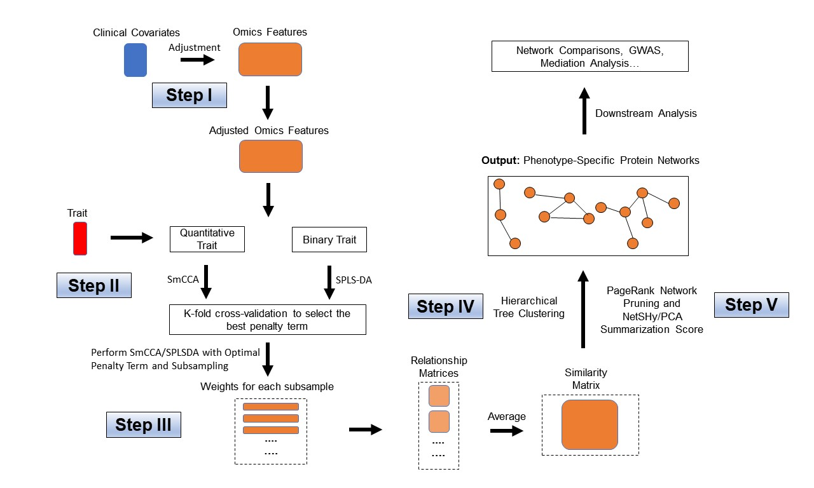
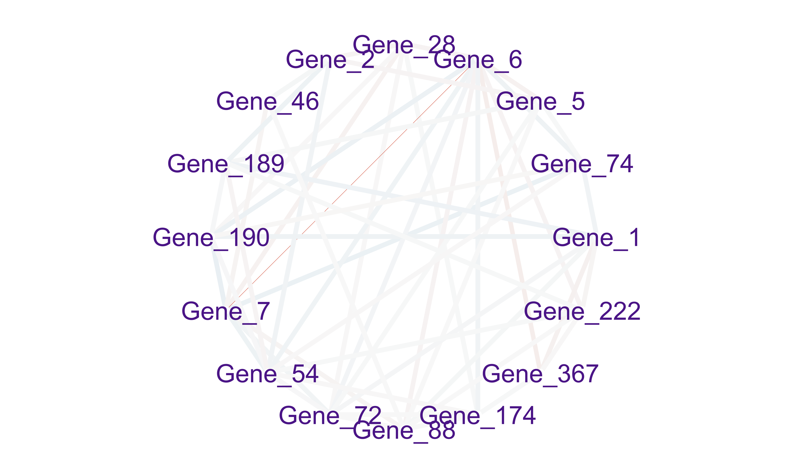

```{r setup, include=FALSE}
knitr::opts_chunk$set(echo = TRUE)
```


## SmCCNet package

The SmCCNet package has the following dependencies: 

```{r, echo = FALSE, results = "hide", warning = FALSE, eval = TRUE}
suppressPackageStartupMessages({
    library(PMA)
    library(pbapply)
    library(Matrix)
    library(igraph)
})
```
```{r, eval = TRUE}
library(PMA)
library(pbapply)
library(Matrix)
library(igraph)
library(SmCCNet)
library(parallel)
```


This section provides a tutorial on running the SmCCNet algorithm for a quantitative phenotype using single-omics data. Please see other vignettes for multi-omics applications.


# SmCCNet single-omics workflow with a synthetic dataset

```{r flowPlot, out.width="100%", fig.cap = "Workflow for SmCCNet single-omics setting (binary and quantitative phenotype).", echo = FALSE}

```


As an example, we consider a synthetic data set with 500 genes $(X_1)$ expression levels measured for 358 subjects, along with a quantitative phenotype $(Y)$. The example has a single phenotype, but a 
multi-dimensional phenotype matrix is also possible. 
 
```{r example data}
data(ExampleData)
head(X1[ , 1:6])
head(Y)
```

Denote the number of features in $X_1$ as $p_1$ and the number of subjects as $n$.
```{r p1p2, eval = TRUE}
p1 <- ncol(X1)
N <- nrow(X1)
AbarLabel <- colnames(X1)
```

## Step I. Preprocessing 

The first step is to preprocess the single omics data. All canonical correlation analysis (CCA) methods require data sets to be standardized 
(centered and scaled) by columns (e.g. features) to ensure the equivalent contribution of each feature when 
maximizing covariance. In addition, there are some other necessary steps to preprocess the data. In our data 
preprocessing pipeline, the following options are given:

- **CoV Filtering**: Filter features based on coefficients of variation (CoV).
- **Standardization**: Center and/or scale data.
- **Adjust for Covariates**: Regress out specified covariates and return residuals

Below is an example of data preprocessing with only feature filtering and standardization, in this case, there is no 
covariate adjustment, the coeffcient of variation filtering quantile is 0.2 (meaning that features with CoV smaller than 20% quantile of CoV will be filtered out), and data are centered and scaled:


```{r, eval = FALSE}
# preprocess data
processed_data <- dataPreprocess(X = as.data.frame(X1), covariates = NULL, 
                  is_cv = TRUE, cv_quantile = 0.2, center = TRUE, scale = TRUE)
```


## Step II: Determine optimal sparsity penalties through cross-validation (optional)

To find the optimal sparsity penalties, we apply a K-fold cross-validation on the synthetic data (Figure 1). Let $p_1$ denote 
the number of features in omics data $X_1$ respectively, and $s_1$ is the proportion of $X_1$ features to be 
sampled every time. The sparse penalties range from 0.05 to 0.3 with step size of 0.05. Large penalty values 
correspond to less sparse canonical weight vector, while small penalties correspond to sparser canonical weight 
vector. Below is the list of parameters that need to be specified:

- $K$: Number of folds in cross-validation (CV). Typically a 5-fold CV is sufficient. If the training set contains too few (e.g. $<30$) samples, or the test or training set becomes unscalable, then choose a smaller $K$.
- $s_1$: Proportion of feature subsampling from $X_1$. 
- $SubSamp$: Total number of subsamples for subsampling step.


```{r CVpara, eval = FALSE, warning = FALSE}
K <- 3 # number of folds in K-fold CV.
s1 <- 0.7
subSamp <- 50 # number of subsamples.

# create sparsity penalty options.
pen1 <- seq(.05, .3, by = .05)

# set a CV directory.
CVDir <- "Example3foldCV/" 
pheno <- "Example3foldCV"
dir.create(CVDir)
```


### Create test and training data sets. 

To perform K-fold Cross-Validation (CV), we need to split the data ($X_1, Y$) into test and training sets. We have 
included the standardization step within the SmCCNet algorithm. However, for the CV procedure, we recommend to 
standardize the training and test sets upfront, since this helps to choose the number of CV folds $K$. If any data 
set can not be standardized, we recommend to reduce $K$. In the code below, we show how to create CV data sets and 
check if all data sets are valid (i.e. standardizable). The standardized training and test data sets will be saved 
under the CV directory.

```{r make K-fold, eval = FALSE}
# set random seed
set.seed(12345) 

# save data and parameters into local directory
save(X1, Y, s1, subSamp, pen1, 
     file = paste0(CVDir, "Data.Rdata"))

# split data into K folds
foldIdx <- split(1:N, sample(1:N, K))
for(i in 1:K){
  iIdx <- foldIdx[[i]]
  x1.train <- scale(X1[-iIdx, ])
  yy.train <- Y[-iIdx, ]
  x1.test <- scale(X1[iIdx, ])
  yy.test <- Y[iIdx, ]
  
  if(is.na(min(min(x1.train), min(yy.train), min(x1.test), min(yy.test)))){
    stop("Invalid scaled data.")
  }
  
  subD <- paste0(CVDir, "CV_", i, "/")
  dir.create(subD)

  # save data from each fold into local directory
  save(x1.train, yy.train, x1.test, yy.test,
       s1, pen1, p1, subSamp,
       file = paste0(subD, "Data.Rdata"))
}
```

### Run K-fold Cross-Validation

For each of the K-fold we compute the prediction error for each penalty pair option. Since there is no subsampling step for cross-validation, we run through cross-validation with nested for loop. However, if the omics data are extremely high-dimensional, we recommend using the R package **parallel** to parallelize the for loop, or use **fastAutoSmCCNet()** directly. **fastAutoSmCCNet()** is the package built-in function that streamline the pipeline with single line of code, and the cross-validation step is parallelized with **future_map()** in **furrr** package.  

```{r run CV, eval = FALSE}
# number of clusters in parSapply should be the same as number specified above
suppressWarnings(for (CVidx in 1:K)
{
  # define the sub-directory for each fold 
  subD <- paste0(CVDir, "CV_", CVidx, "/")
  # load fold data
  load(paste0(subD, "Data.Rdata"))
  dir.create(paste0(subD, "SmCCA/"))
  # create empty vector to store cross-validation result
  RhoTrain <- RhoTest <- DeltaCor <- rep(0, length(pen1))
  # evaluate through all the possible penalty candidates
  for(idx in 1:length(pen1)){
    l1 <- pen1[idx]
    print(paste0("Running SmCCA on CV_", CVidx, " pen=", l1))
    # run single-omics SmCCNet
    Ws <- getRobustWeightsSingle(x1.train, as.matrix(yy.train), l1, 1,
                                    SubsamplingNum = 1)
    # average
    meanW <- rowMeans(Ws)
    v <- meanW[1:p1]
    
    rho.train <-  cor(x1.train %*% v, yy.train)
    
    
    rho.test <- cor(x1.test %*% v, yy.test) 
    
    
    RhoTrain[idx] <- round(rho.train, digits = 5)
    RhoTest[idx] <- round(rho.test, digits = 5)
    DeltaCor[idx] <- abs(rho.train - rho.test)
    
   
    
  }
  
  DeltaCor.all <- cbind(pen1, RhoTrain, RhoTest, DeltaCor)
  colnames(DeltaCor.all) <- c("l1", "Training CC", "Test CC", "CC Pred. Error")
  write.csv(DeltaCor.all,
            file = paste0(subD, "SmCCA/SCCA_", subSamp,"_allDeltaCor.csv"))
  
  
})
```


### Extract penalty term with the smallest total prediction error

Finally, we extract the total prediction errors and return the best penalty term. This step will 
automatically give the optimal testing canonical correlation choice as well as prediction error choice, 
which serves as a reference for the penalty term selection. There are multiple different ways to select the 
best penalty terms, one of the simplest way is to minimize discrepancy between the training canonical 
correlation and the testing canonical correlation. However, this method does not take the magnitude of 
testing canonical correlation into account, which means it may end up selecting the penalty term with smaller 
canonical correlation (low signal). For instance, if a certain penalty term yields the training canonical correlation of 0.7, with the testing canonical correlation of 0.4, and another penalty term yield the training canonical correlation of 0.4, with the testing canonical correlation of 0.2, minimizing training and testing canonical correlation selects the latter. To address this problem, we minimize $\frac{CC_{train} - 
CC_{test}}{CC_{test}}$. This method ensures that we (1) maintain a low discrepancy between training result 
and testing result, and (2) guarantee a relatively high testing canonical correlation.


```{r aggregate error, eval = FALSE}
# combine prediction errors from all K folds and compute the total prediction
# error for each sparsity penalty pair.
aggregateCVSingle(CVDir, "SmCCA", NumSubsamp = subSamp, K = K)
```


## Step III: Run SmCCA with pre-selected penalty term

With a pre-selected penalty term, we apply SmCCA to subsampled features of $X_1$ and $Y$, and repeat the 
process to generate a robust similarity matrix (Figure 1). If the penalties were selected through a K-fold
cross-validation, the subsampling proportions $s_1$ need to be consistent with what was used in the CV. As
for the number of subsamples, a larger number of subsamples leads to more stable results, while a smaller 
number of subsamples is faster computationally. We use 100 in this example.  After obtaining the canonical
weight $Ws$, which has the dimension of $p_1$ (number of features) by $s_1$ (number of subsamples), the next step is to obtain the adjacency matrix by taking the outer product of each $W$ with itself to obtain an adjacency matrix and average the matrices to obtain $Abar$, a sparse matrix object. 

```{r get abar, eval = FALSE}
# set up directory to store all the results
plotD <- paste0(CVDir, "Figures/")
saveD <- paste0(CVDir, "Results/")
dataF <- paste0(CVDir, "Data.Rdata")
dir.create(plotD)
dir.create(saveD)
dir.create(dataF)

# type of CCA result, only "SmCCA" supported
Method = "SmCCA"


# after SmCCA CV, select the best penalty term, 
# and use it for running SmCCA on the complete dataset
for(Method in "SmCCA"){
  # select optimal penalty term from CV result
  T12 <- read.csv(paste0(CVDir, "Results/", Method, "CVmeanDeltaCors.csv"))
  pen <- T12[which.min(T12[ ,4]/abs(T12[ ,3])) ,2]
  
  
  if(Method == "SmCCA"){
    FilterByTrait <- FALSE
  }else if(Method == "SsCCA"){
    FilterByTrait <- TRUE
  }
  
  l1 <- pen;
  system.time({
    Ws <- getRobustWeightsSingle(X1 = X1, Trait = as.matrix(Y), 
                                       Lambda1 = l1, 
                                       s1, SubsamplingNum = subSamp)
    
    
    Abar <- getAbar(Ws, P1 = p1, FeatureLabel = AbarLabel[1:p1])
    save(l1, X1, Y, s1, Ws, Abar,
         file = paste0(saveD, Method, K, "foldSamp", subSamp, "_", pen, 
                       ".Rdata"))
  })
  
  
}
```


## Step IV: Obtain single-omics modules through network clustering

From the similarity matrix obtained in the last step, we obtain single-omics modules by applying hierarchical tree cutting and plotting the reconstructed networks. The edge signs are recovered from pairwise feature correlations.

```{r get modules, eval = FALSE}
# perform clustering based on the adjacency matrix Abar 
OmicsModule <- getOmicsModules(Abar, PlotTree = FALSE)

# make sure there are no duplicated labels
AbarLabel <- make.unique(AbarLabel)

# calculate feature correlation matrix
bigCor2 <- cor(X1)

# data type
types <- rep('gene', nrow(bigCor2))
```


## Step V: Obtain network summarization and network pruning


The next step is to prune the network so that the unnecessary features (nodes) will be filtered from the original network module. This principle is based on a subject-level score of interest known as the network summarization score. There are two  different network summarization methods: PCA and NetSHy (network summarization via a hybrid approach, Vu et al 2023 Bioinformatics), which are specified by the argument 'method'. We evaluate two criteria stepwise 1) summarization score correlation with respect to the phenotype, which is used to verify if the summarization score for the current subnetwork has a strong signal  with respect to the phenotype and 2) The correlation between the summarization of the current subnetwork and that of the baseline network with a pre-defined baseline network size. This is used to check if the addition of more molecular features introduces noise. The stepwise approach for network pruning is:

\begin{itemize}
\item Calculate PageRank score for all molecular features in global network, and rank them according to PageRank score.
\item Start from minimally possible network size $m_1$, iterate the following steps until reaching the maximally possible network size $m_2$
 (defined by users):\begin{itemize}
 \item Add one more molecular feature into the network based on node ranking, then calculate NetSHy/PCA summarization score (PC1 - PC3) for this updated network.
 \item Calculate the correlation between this network summarization score and phenotype for all the possible network size $i \in [m_1,m_2]$, and only use PC with the highest (determined by absolute value) w.r.t. phenotype, define this correlation as $\rho_{(i,pheno)}$, where $i$ stands for the current network size.
 \end{itemize}
  \item Identify network size $m_*$ ($m_* \in [m_1, m_2]$) with $\rho_{(m_*, pheno)}$ being the maximally possible summarization score correlation w.r.t. phenotype (determined by absolute value).
\item Treat $m_*$ as the new baseline network size, let $\rho_{(m_*,i)}$ be the correlation of summarization score between network with size $m_*$ and network with size $i$. Define $x$ to be the network size ($x \in [m_{min}, m_2]$), such that $x = \max \{ i| (i \in [m_*, m_2])  \& (|\rho_{(m,i)}| > 0.8) \}$.
\item Between network size of $m$ and $x$, the optimal network size $m_{opt}$ is defined to be the maximum network size such that $|\rho_{m_{(opt, pheno)}}| \geq 0.9 \cdot |\rho_{(m,pheno)}|$.
\end{itemize}


In the following example, the summarization used is the regular first principal component, we directly prune the global network for a subnetwork, and the optimal network size is 16. The output from this steps contains a network adjacency matrix, summarization scores (first 3 PCs), PC loadings and more, which are stored in a .Rdata file in the user specified location.

```{r network summarization, eval = FALSE}
networkPruning(Abar = Abar,CorrMatrix = bigCor2, type = types, 
                           data = X1, Pheno = Y, 
                           ModuleIdx = 1, min_mod_size = 10, 
                           max_mod_size = 100, method = 'PCA', 
                           saving_dir = getwd())
```


To obtain sufficient number of nodes for the network, we implement the network pruning algorithm directly on the global network. However, users can trim each network module obtained through hierarchical clustering with the following code:

```{r, eval = FALSE}
# filter out network modules with insufficient number of nodes
module_length <- unlist(lapply(OmicsModule, length))
network_modules <- OmicsModule[module_length > 10]
# extract pruned network modules
for(i in 1:length(network_modules))
{
  cat(paste0('For network module: ', i, '\n'))
  # define subnetwork
  abar_sub <- Abar[network_modules[[i]],network_modules[[i]]]
  cor_sub <- bigCor2[network_modules[[i]],network_modules[[i]]]
  # prune network module
  networkPruning(Abar = abar_sub,CorrMatrix = cor_sub, 
                          type = types[network_modules[[i]]], 
                 data = X1[,network_modules[[i]]],      
			  Pheno = Y, ModuleIdx = i, min_mod_size = 10, 
                          max_mod_size = 100, method = 'PCA', 
                          saving_dir = getwd())
  cat("\n")
}
```


# Results

We present the single-omics network result based on the synthetic data. The first table below contains the individual molecular features correlation with respect to phenotype, and their associated p-value (from correlation testing).

```{r, eval = TRUE,echo = FALSE, warning = FALSE, message = FALSE}
load('../vignettes/cont_size_16_net_1.Rdata')
row.names(omics_correlation_data) <- NULL
colnames(omics_correlation_data) <- c('Molecular Feature', 'Correlation to Phenotype', 'P-value')
knitr::kable(omics_correlation_data, caption = 'Individual molecular features correlation table with respect to phenotype (correlation and p-value).')
```

Below is the visualization of the PC loadings based on the first NetSHy PC, which represents the contribution of each molecular features to the first NetSHy PC. 


```{r, echo = FALSE, warning = FALSE, message = FALSE, out.width="100%", fig.cap = "PC1 loading for each subnetwork feature."}
library(grid)
library(tidyverse)
library(shadowtext)
library(reshape2)
BLUE <- "#076fa2"
data <- data.frame(name = row.names(pc_loading), loading = abs(pc_loading[,1]))
plt <- ggplot(data) +
  geom_col(aes(loading, name), fill = BLUE, width = 0.6) 

plt
```

```{r, echo = FALSE, warning = FALSE, message = FALSE, out.width="100%", fig.cap = "Correlation heatmap for subnetwork features."}
###### Correlation heatmap
melted_cormat <- melt(correlation_sub)
ggplot(data = melted_cormat, aes(x=Var1, y=Var2, fill=value)) + 
  geom_tile() +
   labs(title = "Correlation Heatmap of Network Features") + 
  theme(plot.title.position = "plot")
```

```{r, echo = FALSE, warning = FALSE, message = FALSE, out.width="100%", fig.cap = "Adjacency matrix heatmap for subnetwork features."}
###### Correlation heatmap
melted_cormat <- melt(as.matrix(M))
ggplot(data = melted_cormat, aes(x=Var1, y=Var2, fill=value)) + 
  geom_tile() +
   labs(title = "Adjacency Matrix Heatmap of Network Features") + 
  theme(plot.title.position = "plot")

```

In addition, there are two network heatmaps based on (1) correlation matrix, and (2) adjacency matrix. Based on the summarization table, genes 1,2,6, and 7 have relatively high correlation with respect to phenotype. The PC loadings also confirm that genes 1,2,6,and 7 generally have higher correlation with respect to phenotype. From the correlation heatmap, we do not observe associations between molecular features, but for the adjacency matrix heatmap, we observe the higher connections between genes 1,2,6, and 7.

## Step VI: Visualize network module

To visualize the final network module, we need to download the Cytoscape software, and use the package RCy3 to visualize the subnetwork generated from the network trimming step. In general, since the network obtained through the PageRank trimming algorithm is densely connected, and some of the edges may be false positive (meaning that two nodes are not associated, but with higher edge values in the adjacency matrix). Therefore, we use the correlation matrix to filter out those weak network edges.

In the network visualization,  different colored edges denote  different directions of the association between two nodes, where red or blue denotes a positive or negative association respectively. The width of the edge represents the connection strength between two nodes. 


```{r, eval = FALSE}
library(RCy3)
library(igraph)
M <- as.matrix(M)

# correlation matrix for the subnetwork
filter_index <- which(abs(correlation_sub) < 0.05)
M_ind <- ifelse(correlation_sub > 0, 1, -1)
M_adj <- M * M_ind
M_adj[filter_index] <- 0
diag(M_adj) <- 0

# network visualization through cytoscape
graph <- igraph::graph_from_adjacency_matrix(M_adj, mode = 'undirected', 
         weighted = TRUE, diag = TRUE, add.colnames = NULL, add.rownames = NA)

# define network node type and connectivity
V(graph)$type <- sub_type
V(graph)$type
V(graph)$connectivity <- rowSums(abs(M))
V(graph)$connectivity

createNetworkFromIgraph(graph,"single_omics_network")
```

```{r netPlot, out.width="100%", fig.cap = "Trimmed module 1. The strength of the node connections is indicated by the thickness of edges. Red edges and blue edges are for negative and positive connections respectively.", echo = FALSE}

```


# Single-omics SmCCNet for Binary Phenotype


This section provides a tutorial on running the SmCCNet algorithm for a binary phenotype using single-omics data. Given the binary nature of the phenotype, canonical correlation analysis can be applied, but it may pose challenges due to the correlation issues with binary random variables. To address this, we employ Sparse Partial Least Squares Discriminant Analysis (SPLS-DA) to modify the SmCCNet algorithm for binary phenotype.

SPLS-DA operates with a dual-stage approach aimed at predicting the phenotype. Initially, it treats the binary phenotype as a quantitative variable and applies partial least squares to derive multiple latent factors. Subsequently, these latent factors are used to predict the binary phenotype using logistic regression. The latent factors are then consolidated into a single factor based on the logistic regression coefficient.

Similar to sparse multiple canonical correlation analysis (SmCCA) used in the quantitative phenotype analysis for SmCCNet, a sparsity parameter needs to be tuned. However, for SPLS-DA, an increase in the penalty value results in a higher level of sparsity, which is contrary to the CCA-based method implemented in this package. It's also important to note that this algorithm is designed specifically for binary phenotypes. For users dealing with multi-class phenotypes, a one-versus-all approach can be used to generate networks separately if the multi-class phenotype is not ordinal. Alternatively, if the multi-class phenotype is ordinal, a CCA-based approach can be applied. See last section for code for the multi-class phenotype case.

## Import synthetic dataset with binary phenotype

As an example, we consider a synthetic data set with 500 genes $(X_1)$ expression levels measured for 358 subjects, along with a binarized phenotype $(Y)$ by taking the median of original phenotype as the cutoff, and transforming it into binary variable.

```{r example data binary}
getwd()
data(ExampleData)
head(X1[ , 1:6])
head(Y)
# binarize quantitative outcome 
Y <- ifelse(Y > median(Y), 1, 0)
```

Denote the number of features in $X_1$ as $p_1$, and the number of subjects as $n$.

```{r p1p2 binary, eval = TRUE}
p1 <- ncol(X1)
N <- nrow(X1)
AbarLabel <- colnames(X1)
```


The parameter setup for this approach mirrors that of SmCCA, and for more specific information, please refer back to the single-omics quantitative phenotype in section 1.

```{r, eval = FALSE}
K <- 3 # number of folds in K-fold CV.
CCcoef <- NULL # unweighted version of SmCCNet.
s1 <- 0.7 # feature subsampling percentage.
subSamp <- 50 # number of subsamples.
metric <- 'auc' # evaluation metric to be used.

# create sparsity penalty options.
pen1 <- seq(.1, .9, by = .1)

# set a CV directory.
CVDir <- "Example3foldCV_Binary/" 
pheno <- "Example3foldCV_Binary"
dir.create(CVDir)

Y <- ifelse(Y > median(Y), 1, 0)
```

## Step II: Determine optimal sparsity penalties through cross-validation (optional)

The SPLS package does not include a method for assessing prediction accuracy. Therefore, we utilize the caret package's classifier to evaluate the performance of our model. Particularly for SPLS-DA, the number of components is an important factor to consider as the goal is to make predictions. In the following example, we select three as the number of components. All other procedures remain identical to those in SmCCA (see single-omits quantitative phenotype vignette).


```{r make K-fold 2, eval = FALSE}
set.seed(12345) # set random seed.
# necessary packages for  K-fold cross-validation
library(caret)
# save original data into local directory
save(X1, Y, s1, subSamp, pen1, 
     file = paste0(CVDir, "Data.Rdata"))


# define the number of components to be extracted
ncomp <- 3
# split data into k folds
foldIdx <- split(1:N, sample(1:N, K))
for(i in 1:K){
  iIdx <- foldIdx[[i]]
  x1.train <- scale(X1[-iIdx, ])
  yy.train <- Y[-iIdx, ]
  x1.test <- scale(X1[iIdx, ])
  yy.test <- Y[iIdx, ]
  
  if(is.na(min(min(x1.train), min(yy.train), min(x1.test), min(yy.test)))){
    stop("Invalid scaled data.")
  }
  
  subD <- paste0(CVDir, "CV_", i, "/")
  dir.create(subD)
  save(x1.train, yy.train, x1.test, yy.test,
       s1, pen1, p1, subSamp,
       file = paste0(subD, "Data.Rdata"))
}

############################################## Running Cross-Validation

# run SmCCA with K-fold cross-validation
suppressWarnings(for (CVidx in 1:K){
  # define evaluation method
  EvalMethod <- 'precision'
  # define and create saving directory
  subD <- paste0(CVDir, "CV_", CVidx, "/")
  load(paste0(subD, "Data.Rdata"))
  dir.create(paste0(subD, "SmCCA/"))

  # create empty vector to store cross-validation accuracy result
  TrainScore <- TestScore <- rep(0, length(pen1))
  for(idx in 1:length(pen1)){
    # define value of penalty
    l1 <- pen1[idx]

    # run SPLS-DA to extract canonical weight
    Ws <- spls::splsda(x = x1.train, y = yy.train, K = ncomp, eta = l1, 
                       kappa=0.5,
                       classifier= 'logistic', scale.x=FALSE)

    # create emtpy matrix to save canonical weights for each subsampling
    weight <- matrix(0,nrow = ncol(x1.train), ncol = ncomp)
    weight[Ws[["A"]],] <- Ws[["W"]]

    # train the latent factor model with logistic regression
    train_data <- data.frame(x = (x1.train %*% weight)[,1:ncomp], 
                             y = as.factor(yy.train))
    test_data <- data.frame(x = (x1.test %*% weight)[,1:ncomp])
    
    logisticFit <- stats::glm(y~., family = 'binomial',data = train_data)
    # make prediction for train/test set
    train_pred <- stats::predict(logisticFit, train_data, type = 'response')
    test_pred <- stats::predict(logisticFit, test_data, type = 'response')
    # specifying which method to use as evaluation metric
    TrainScore[idx] <- classifierEval(obs = yy.train, 
                                      pred = train_pred, 
                                      EvalMethod = metric, print_score = FALSE)
    TestScore[idx] <- classifierEval(obs = yy.test, 
                                      pred = test_pred, 
                                      EvalMethod = metric, print_score = FALSE)
    
  }

  # combine cross-validation results
  DeltaAcc.all <- as.data.frame(cbind(pen1, TrainScore, TestScore))
  DeltaAcc.all$Delta <- abs(DeltaAcc.all$TrainScore - DeltaAcc.all$TestScore)
  colnames(DeltaAcc.all) <- c("l1", "Training Score", "Testing Score", "Delta")
  
  # save cross-validation results to local directory
  write.csv(DeltaAcc.all,
            file = paste0(subD, "SmCCA/SCCA_", subSamp,"_allDeltaCor.csv"))
  
}
)
```

## Step III: Run SmCCA with pre-selected penalty term

Unlike the CCA-based method, the selection of the optimal penalty term here is centered on evaluating prediction accuracy - specifically, identifying the penalty term that yields the highest prediction accuracy for the phenotype. The following example employs the penalty term with the greatest testing prediction accuracy to execute the PLSDA algorithm on the entire dataset.


```{r, eval = FALSE}
# save cross-validation result
cv_result <- aggregateCVSingle(CVDir, "SmCCA", NumSubsamp = subSamp, K = 3)

# create directory to save overall result with the best penalty term
plotD <- paste0(CVDir, "Figures/")
saveD <- paste0(CVDir, "Results/")
dataF <- paste0(CVDir, "Data.Rdata")
dir.create(plotD)
dir.create(saveD)
dir.create(dataF)

# specify method (only SmCCA works)
Method = "SmCCA"

for(Method in "SmCCA"){
  # read cross validation result in
  T12 <- read.csv(paste0(CVDir, "Results/", Method, "CVmeanDeltaCors.csv"))
  # determine the optimal penalty term
  pen <- T12[which.max(T12[ ,3]) ,2]
  l1 <- pen;
  system.time({
    # run SPLSDA with optimal penalty term
    Ws <- getRobustWeightsSingleBinary(X1 = X1, Trait = as.matrix(Y), 
                                       Lambda1 = l1, 
                                       s1, SubsamplingNum = subSamp)
   
    # get adjacency matrix
    Abar <- getAbar(Ws, P1 = p1, FeatureLabel = AbarLabel[1:p1])
    # save result into local directory
    save(l1, X1, Y, s1, Ws, Abar,
         file = paste0(saveD, Method, K, "foldSamp", subSamp, "_", pen, 
                       ".Rdata"))
  })
  
  
}
```


After this step, all the other steps are a consistent with single-omics quantitative phenotype example, refer to section 1.4 and 1.5 for more information.


# Session info

```{r sessionInfo}
sessionInfo()
warnings()
```


# References

> Shi, W. J., Zhuang, Y., Russell, P. H., Hobbs, B. D., Parker, M. M., Castaldi, P. J., ... & Kechris, K. (2019). Unsupervised discovery of phenotype-specific multi-omics networks. Bioinformatics, 35(21), 4336-4343.

> Vu, T., Litkowski, E. M., Liu, W., Pratte, K. A., Lange, L., Bowler, R. P., ... & Kechris, K. J. (2023). NetSHy: network summarization via a hybrid approach leveraging topological properties. Bioinformatics, 39(1), btac818.

